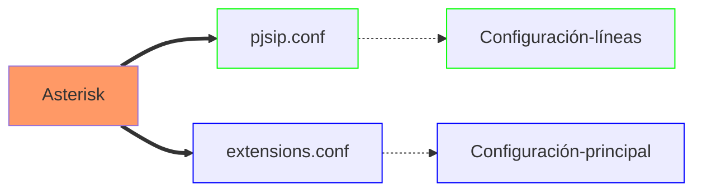
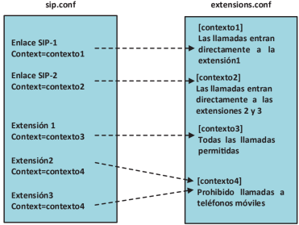
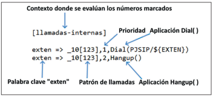

# PROGRAMACIÓN DE ASTERISK EN ĆONSOLA DE COMANDOS

- [PROGRAMACIÓN DE ASTERISK EN ĆONSOLA DE COMANDOS](#programación-de-asterisk-en-ćonsola-de-comandos)
  - [Arquitectura del protocolo SIP](#arquitectura-del-protocolo-sip)
    - [Contenido de un mensaje SIP](#contenido-de-un-mensaje-sip)
    - [Otros protocolos de señalización en telefonía IP](#otros-protocolos-de-señalización-en-telefonía-ip)
  - [Instalación y configuración de Asterisk Exchange](#instalación-y-configuración-de-asterisk-exchange)
  - [Ficheros de configuración en Asterisk Exchange](#ficheros-de-configuración-en-asterisk-exchange)
  - [Configuración del fichero pjsip.conf](#configuración-del-fichero-pjsipconf)
  - [Configuración del dialplan](#configuración-del-dialplan)
  - [La aplicación Dial()](#la-aplicación-dial)
    - [Options en la aplicación Dial()](#options-en-la-aplicación-dial)
      - [Conversión de audio MP3-WAV](#conversión-de-audio-mp3-wav)
      - [Límite de tiempo de llamada](#límite-de-tiempo-de-llamada)
      - [Mensaje de audio al comienzo de la llamada](#mensaje-de-audio-al-comienzo-de-la-llamada)
      - [Colgado de la llamada al cabo de n segundos](#colgado-de-la-llamada-al-cabo-de-n-segundos)
      - [Transferencia de llamadas](#transferencia-de-llamadas)
  - [Patrones de Marcado y Escritura Compacta del DIALPLAN()](#patrones-de-marcado-y-escritura-compacta-del-dialplan)
    - [Uso de la Variable ${EXTEN}](#uso-de-la-variable-exten)
    - [Selección de Dígitos en la Variable ${EXTEN}](#selección-de-dígitos-en-la-variable-exten)
    - [Aplicación SayNumber()](#aplicación-saynumber)

---

- [Prácticas SIP](practic_sip/practicsip_01.md)
- [Prácticas PJSIP](practic_pjsip/practpjsip.md)

---

## Arquitectura del protocolo SIP

En la arquitectura del protocolo **SIP** los elementos situados en los extremos de la comunicación que intercambian métodos y respustas en una sesión se denominan _agentes de usuarios (UA)_ y puede adoptar tanto el papel de clientes (UAC) como el papel de servidores (UAS) dependiendo de si hacen peticiones o reciben peticiones.

Una sesión **SIP** puede ser iniciada, modificada y finalizada entre dos agentes de usuario sin que sea necesario ningún otro elemento intermedio en lo que se conoce como modo _peer-to-peer_, permitiendo efectuar una llamada telefónica entre dos teléfonos IP sin necesidad de centralita.

En el modo **peer to peer** es necesario que el teléfono que llama, conozca la dirección IP del teléfono con el que quiere iniciar la llamada.

**SIP** identifica a los usuarios por su URI (_Universal Resource Identifiers_) en la forma: `user@dominio/dirección IPv4:puerto`. Por ejemplo, para la extensión 101, que está en la dirección 192.168.1.180 su identificador sería: `101@192.168.1.180:5060`. Si no se especifica el número de puerto, se entiende que es 5060 UDP.

### Contenido de un mensaje SIP

Los mensajes SIP están escritos en código ASCII y su contenido se divide en dos partes: una cabecera del mensaje (_message header_) y un cuerpo del mensaje (_message body_).

Las partes más importantes de la cabecera de un mensaje SIP:

1. **Línea de comienzo**: si corresponde a un mensaje de petición o _request_ recibe el nombre de _request-line_ y si corresponde a un mensaje de respuesta recibe el nombre de _status-line_.
   - **Request-line**: contiene el tipo de mensaje SIP, en la forma `usuario_destino@dominio/dirección IPv4:puerto`.
   - **Status-line**: contiene la versión del protocolo SIP, el código numérico de respuesta y la frase o texto que lo identifica.
2. **Message Header**: indica el comienzo de cabecera.
   - **Via**: dirección IP donde se debe enviar la respuesta.
   - **Max-Forwards**: valor comprendido entre 0 y 255 que fija el número máximo de _Proxys_ que puede atravesar el mensaje.
   - **To**: identificación del receptor del mensaje en la forma, `usuario_destino@dominio`.
   - **From**: identificación del emisor del mensaje en la forma, `usuario_origen@dominio`.
   - **Cseq**: contiene un número entero que va aumentando en una unidad con cada nuevo mensaje que se envía. Junto con ese número también va un identificador del tipo de mensaje.
   - **Allow**: lista de métodos soportados por el agente de usuario que envía el mensaje, por ejemplo: INVITE, ACK, OPTIONS, CANCEL, BYE.
   - **Content-length**: número de bytes que ocupa el cuerpo del mensaje.

### Otros protocolos de señalización en telefonía IP

- **H.323**: es un protocolo creado inicialmente alrededor de 1995 para aplicaciones de videoconferencia sobre cualquier tipo de red de paquetes. Inconveniente con la telefonía sobre redes IP. H.232 cuenta, al igual que SIP, con unos elementos denominados _gatekeeper_ que permiten la traducción de identificadores de usuario a direcciones IP, el registro y su localización.
- **IAX** (_Inter-Asterisk Exchange_): IAX surge como respuesta a la complejidad de SIP y a las dificultades que tiene este protocolo para funcionar en redes protegidas por cortafuegos o con sistemas de traducción de direcciones de red NAT. IAX utiliza el puerto UDP 4569 para la señalización y para el envío del contenido multimedia de varias comunicaciones simultáneas.

## Instalación y configuración de Asterisk Exchange

[Instalación y configuración de Asterisk](https://agfhdg.wordpress.com/2021/05/05/freepbx-instalacion-y-configuracion/)

[Tera Term](https://teratermproject.github.io/index-en.html)

[Putty](https://www.putty.org/)

## Ficheros de configuración en Asterisk Exchange

Comprobar mediante el comando `systemctl status asterisk` que Asterisk está cargado y activo. En caso que no esté iniciado, ejecutar el comando `systemctl start asterisk` para iniciar el servicio.

En Asterisk se requiere de una configuración en el fichero **pjsip.conf** en la ruta **/etc/asterisk/** indicada. Una vez configuradas líneas y extensiones, es necesario configurar qué debe hacer Asterisk cada vez que, una de las extensiones marca un número, o cada vez que entra una llamada por una de las líneas IP, lo cual se lleva a cabo en el fichero **extensions.conf**, situado en el directorio **/etc/asterisk** y que es el fichero de configuración más importante de Asterisk.



Asterisk utiliza para diferenciar entre las diferentes líneas y extensiones los denominados **_context_** o contextos. Varias líneas o extensiones pueden estar en el mismo contexto si comparten las mismas propiedades, pero cada línea o extensiones solo puede estar en un único contexto.

Extensiones situadas en contextos diferentes producen un resultado distinto en Asterisk cuando marcan el mismo número y llamadas entrantes por diferentes líneas son enviadas a diferentes destinos en función del contexto donde se encuentra cada uno de los enlaces SIP.

Los ficheros **pjsip.conf** y **extensions.conf** están relacionados por los **context**. a líneas y extensiones se les asignan un _context_ en el fichero _pjsip.conf_ y en el fichero _extensions.conf_ se define que debe hacer Asterisk en cada uno de ellos.



El uso de **contextos** le da a Asterisk una gran flexibilidad sorprendente para realizar cualquier tipo de configuración con las líneas y extensiones.

El fichero **pjsip.conf** se utiliza únicamente, para la definición de líneas IP y extensiones IP con el protocolo SIP basado en el _driver_ de canal **chan_pjsip**.

Otros protocolos utilizan sus propios ficherso de configuración, como **iax.conf** para el protocolo IAX o sip.conf para el protocolo SIP, basado en el ya obsoleto driver de canal **chan_sip**.

Se recomienda renombrar los ficheros **pjsip.conf** y **extensions.config** y realizar la configuración de la PBX sobre ficheros nuevos y sin contenido. Los pasos que hay que dar para trabajar sobre un fichero nuevo (_pjsip.conf_) son:

- Acceder al directorio **/etc/asterisk**.
- Copia el archivo _pjsip.conf_ a _pjsip.conf.old_: `cp pjsip.conf pjsip.conf.old`.
- Se puede realizar con el comando **mv** en lugar de **cp**.
- Editar el nuevo archivo _pjsip.conf_: `vim pjsip.conf`.

Sobre este nuevo fichero se introducen los parámetros de configuración deseados mediante el lenguaje de _script_ de Asterisk.

## Configuración del fichero pjsip.conf

El contenido se divide en secciones, encabezadas por el nombre de la sección entre corchetes y tanto en la configuración de las extensiones como en las líneas IP, utiliza un enfoque modular que permite reutilizar código común y separar a nivel lógico los diferentes parámetros de configuración, como puede ser el tipo de transporte (tcp, udp, tls) la autenticación o la identificación de la línea.

en la configuración son necesarias cuatro secciones:

1. Sección de tipo **endpoint**. Es la principal sección, el nombre debe ser igual al valor del campo _nombre del usuario_ de la extensión. En esta sección se define el contexto de la extensión, los códecs de voz utilizados y enlaces a las secciones de tipo _transport_, _aor_ y _auth_.
2. Sección de tipo **transport**: en esta sección se define la capa de transporte utilizada por la pila PJSIP con la extensión o el enlace SIP, la cual puede ser TCP, UDP, WebSockets y transporte encirptado del tráfico de voz mediante protocolos como TLS o SSL. Cuando varias extensiones comparten el mismo método de transporte, se puede compartir una sola sección _transport_ entre todas ellas.
3. Sección de tipo **aor**: aquí Asterisk encuentra los detalles de contacto de un _endpoint_ cuando tiene que enviarle una llamada. Asterisk puede obtener la dirección IP de un _endpoint_ de forma dinámica, a partir de la información del campo _contact_ en la sección de tipo _aor_. El parámetro _max_contacts_ indica el número de _endpoint_ diferentes que pueden ser registrados en la sección _aor_, ya que _pjsip_ permite registrar más de una extensión con el mismo número. El parámetro _remove_existing=yes_ en esta sección no es obligatorio, pero previene desconexiones no previstas de las extensiones. El acrónimo _aor_ significa _address of record_.
4. Sección de tipo **auth**: se definen los parámetros _username_ y _password_ de autenticación de la extensión en el registro. El valor de _username_ debe coincidir con el _nombre de autenticación_ asignado a la extensiones IP física o _softphone_.

En el fichero **pjsip.conf** las extensiones cuentan con: _endpoint_, _aor_ y _auth_ y se comparte en una única sección: _transport_.

Parámetros de interés en el fichero **pjsip.conf**:

- $\Phi$ **protocol=udp**: asignación del protocolo UDP para el funcionamiento de Asterisk.
- $\Phi$ **bind=0.0.0.0**: Asterisk atiende peticiones SIP desde cualquier dirección IP.
- $\Phi$ **disallow=all**: Asterisk desactiva todos los códecs de voz.
- $\Phi$ **allow=alaw**: Asterisk permite únicamente el códec alaw.

## Configuración del dialplan

El fichero **extensions.conf** se denomina también plan de marcación o _dialplan_ y es el fichero que le indica a Asterisk lo que debe hacer cuando una extensión marca un determinado número o cuando una llamada entra por una línea. Este fichero se encuentra en el directorio **/atc/asterisk**.

Se recomienta renombrarlo, los pasos para ello:

- $\Psi$ Acceder al directorio **/etc/asterisk**.
- $\Psi$ **mv extensions.conf extensions.conf.old**.
- $\Psi$ **vim extensions.conf**.

El fichero **extensions.conf** está subdividido en secciones, cuyo nombre se indica entre corchetes al comienzo de las mismas, y se corresponden con cada uno de los contextos definidos en el fichero **sip.conf**.

En cada sección del fichero **extensions.conf** se encuentran una serie de aplicaciones de Asterisk para ser ejecutadas de forma secuencial cada vez que desde una extensión se marca un determinado número o cada vez que entra una llamada por una determinada línea.

Las aplicaciones de Asterisk son propias de la telefonía y todas tienen un nombre que empiezan por mayúsculas y una serie de parámetros entre paréntesis.

| Aplicaciones | Descripción |
| :----------: | :---------- |
| Dial() | realiza una llamada telefónica |
| Playback() | reproduce un mensaje de audio |
| Record() | graba un mensaje de audio |
| Answer() | descuelga una llamada |
| SayNumber() | reproduce un audio con el valor de un número |
| MusicOnHold() | inicia la música en espera |
| MixMonitor() | graba una llamada |
| Hangup() | termina una llamada |

Asterisk cuenta con más de 200 aplicaciones distintas, donde la más importante es **Dial()**, ya que permite hacer llamadas.



- El _context_ evalúa las llamadas, ya que las extensiones tienen asignado \[llamadas-internas\].
- La palabra clave _exten_ seguida de los símbolos **=>**, indica a Asterisk que, a continuación, viene un número que puede ser marcado por alguno de los teléfonos del _context_.
- La cadena \_10[123] es un patrón de llamadas que indica a Asterisk un rango de números. Cualquier número que empiece por los dígitos 10 y a continuación el dígito 1, 2 0 3. Los números 101, 102, 103.
- El siguiente número del patrón, indica la **prioridad**, indicando el orden en el que deben ejecutarse las aplicaciones.
- La aplicación **Dial()** tiene dos parámetros: el primero indica que la llamada se debe hacer mediante el _driver_ del canal _pjsip_ y el segundo indica que se debe llamar al número almacenado en la variable **${EXTEN}**. Esta variable siempre contiene el último número marcado en Asterisk por cualquier de los teléfonos del _context_.
- La aplicación **Hangup()** se ejecuta en segundo lugar porque tiene prioridad 2 y le indica a Asterisk la finalización de las aplicaciones para el patrón de llamadas.

Cuando se modifica el dialplan es necesario recargarlo desde el CLI de Asterisk mediante el comando **dialplan reload**.

---

## La aplicación Dial()

Es la más importante de Asterisk y su función es realizar llamadas. La aplicación **Dial()** tiene los parámetros: `Dial(Tecnología/Recurso, timeout, [options, [URL]])`.

- **Tecnología/Recurso**: indica el driver de la llamada, en este caso el driver _pjsip_.
- **URI**: indica la URI de destino de la llamada. En este caso la URI es el número marcado.
- El parámetro **${EXTEN}** indica el número marcado.
- El parámetro **timeout** indica el tiempo de espera de la llamada. En este caso el tiempo es de 10 segundos.
- El parámetro **options** indica el comportamiento de la llamada. Con funciones como: reproducir audio, grabar audio, descolgar la llamada, limitar la duración de una llamada, activar la musica en espera, etc.

La aplicación **Dial()** se puede utilizar en su forma básica, sin ningún parámetro opcional. El parámetro **timeout** establece el número de segundos durantel cual se envía la llamada al destino, finalizando de forma automática si no es descolgada en el tiempo indicado.

")

```asterisk
[operadora]

exten => 102,1,Dial(pjsip/${EXTEN},10)
 same => n,Hangup()

[trabajadores]

exten => 101,1,Dial(pjsip/${EXTEN},10)
 same => n,Hangup()
```

### Options en la aplicación Dial()

La aplicación **Dial()** cuenta con un amplio conjunto de opciones para el comportamiento de la llamada.

- **m**: activa la música en espera a la parte llammante hasta que la parte llamada descuelga la llamada.
- **L(x[:y][:z])**: limita la duración de la llamada, enviando unos mensajes de aviso cuando falta un cierto tiempo para la finalización. El parámetro **x** indica el tiempo en segundos. El parámetro **y** indica el tiempo en minutos. El parámetro **z** indica el tiempo en horas.
- **A(x)**: reproduce el mensaje de audio especificado por **x** a la parte llamada.
- **S(n)**: cuelga la llamada **n** segundos después de haber sido descolgada.
- **T**: permite transferir una llamada al usuario que la ha iniciado.
- **t**: permite transferir una llamada al usuario que la ha recibido.

Mediante el comando `core show application dial` podemos consultar las opciones disponibles.

Ejemplo de extensión haciendo uso de la música en espera, configuración vállida para _pjsip.conf_:

```asterisk
[internas]

exten => 102,1,Dial(pjsip/${EXTEN},10,m)
 same => n,Hangup()
```

El archivo de audio que se reproduce es uno de los cinco instalados por defecto durante la compilación de Asterisk. Estos ficheros están en formato _wav_ en la ruta: `/var/lib/asterisk/moh`.

Para consultar la lista completa de formatos de audio soportados: `core show file formats`.

Asterisk reproduce el audio por orden alfabético inverso. Para la reproducción aleatorio se elimina la línea `sort=random` incluida en el archivo `musiconhold.conf` en la ruta `/etc/asterisk/musiconhold.conf`. Una vez modificado el fichero, se debe reiniciar ejecutando el comando `moh reload`.

> [!tip]
> Los archivos de audio se recomiendan en formato wav.

#### Conversión de audio MP3-WAV

**SoX (Sound eXchange)** permite convertir ficheros de audio **mp3** a formato **wav**.

- Instalar la aplicación **SoX**: `sudo apt-get install sox libsox-fmt-all`.
- Copiar los archivos de audio _mp3_ al directorio: `/var/lib/asterisk/moh`.
- Ejecutar desde el directorio `/var/lib/asterisk/moh` el comando `sox *.mp3 -c1 -r 8000 *.wav`.

El parámetro **-c1** indica el número de canales de audio (mono). El parámetro **-r 8000** indica la frecuencia de muestreo en Hz.

> [!NOTE]
>
> La música en espera en formato wav para los teléfonos debe estar en formato mono PCM 16 bits y 800 Hz.
>
> El códec G711 alaw utilizado también tiene 800 Hz de frecuencia de muestreo, con 8 bits y cuantificación no uniforme.

#### Límite de tiempo de llamada

La opción `L(x[:y][:z])` en la aplicación **Dial()** finaliza una llamada al cabo de un tiempo determinado, enviando previamente avisos mediante diferentes mensajes de audio.

- **x**: tiempo de duración de la llamada (ms). La llamada finaliza automáticamente al cumplirse este tiempo.
- **y**: tiempo de envío del mensaje de preaviso (ms). Se envía un mensaje de preaviso cuando falta este tiempo para la finalización de la llamda.
- **z**: tiempo de repetición del mensaje de preaviso (ms). El mensaje se repite cada vez que se cumple este tiempo.

Ejemplo de código en el fichero _extensions.conf_:

```conf
[operadora]

exten => 102,1,Dial(PJSIP/102,20)
exten => 102,2,Hangup()

exten => 103,1,Dial(PJSIP/103,20)
exten => 103,2,Hangup()

exten => 104,1,Dial(PJSIP/104,20)
exten => 104,2,Hangup()

exten => 8,1,Dial(PJSIP/102&PJSIP/103&PJSIP/104,30)
exten => 8,2,Hangup()

[trabajadores]

exten => 9,1,Dial(PJSIP/101,20,mL(6000:15000:5000))
exten => 9,3,Hangup()
;6000 límite de tiempo de llamada (60 seg.)
;15000 tiempo de preaviso (15 seg)
;5000 tiempo de repetición de preaviso (5 seg.)
```

Asterisk utiliza para el preaviso de finalización de llamada y para la repetición del preaviso el mensaje denominado _vm-youhave_. Estos mensajes se pueden grabar mediante la aplicación **Record()** y se incluyen en el _dialplan_ asignando la aplicación **Set()** los nombres de los ficheros de audio para reproducir a las siguientes variables:

- **LIMIT_WARNING_FILE= filename**: especifica el fichero de audio de preaviso de finalización de llamada y de repetición del preaviso.
- **LIMIT_CONNECT_FILE= filename**: especifica el fichero de audio que se reproduce al comenzar la llamada.

Ejemplo de grabación de los dos mensajes de audio se realiza desde la extensión situada en el contexto de operadora mediante los números 661 y 662. Al finalizar la grabación es necesario presionar la tecla `#` para que el mensaje quede guardado en el directorio indicado.

Código del archivo _extensions.conf_ para el mensaje de audio personalizados en el límite de tiempo de llamada:

```conf
;con Record() se debe indicar el formato
exten => 661,1,Record(/var/lib/asterisk/sounds/es/AvisoLimite:wav)
exten => 661,2,Hangup()

exten => 662,1,Record(/var/lib/asterisk/sounds/es/AvisoLimite:wav)
exten => 662,2,Hangup()

[trabajadores]
exten => 9,1,Answer(1000)
exten => 9,2,Set(LIMIT_CONNECT_FILE=/var/lib/asterisk/sounds/es/AvisoLimite)
exten => 9,3,Set(LIMIT_WARNING_FILE=/var/lib/asterisk/sounds/es/Preaviso)
exten => 9,4,Dial(PJSIP/101,20,mL(20000:10000:5000))
exten => 9,5,Hangup()
```

El directorio `/var/lib/asterisk/sounds/es` elegido para almacenar estos mensajes de audio. Es también el directorio para almacenar los mensajes de audio del sistema en español.

#### Mensaje de audio al comienzo de la llamada

Con la opción `A(x)` en la aplicación `Dial()`, se puede reproducir un mensaje de audio al comienzo de la llamada. Indicado por el parámetro _x_ cuando el usuario llamado descuelga la llamada. Ejemplo de mensaje de audio: "Le recordamos que por su seguridad esta llamada puede ser grabada".

Fichero _extensions.conf_:

```conf
[operadora]

exten => 102,1,Dial(PJSIP/102,20)
exten => 102,2,Hangup()

exten => 103,1,Dial(PJSIP/103,20)
exten => 103,2,Hangup()

exten => 104,1,Dial(PJSIP/104,20)
exten => 104,2,Hangup()

exten => 8,1,Dial(PJSIP/102&PJSIP/103&PJSIP/104,30)
exten => 8,2,Hangup() 

exten => 661,1,Record(/var/lib/asterisk/sounds/es/AvisoLimite:wav)
exten => 661,2,Hangup()

[trabajadores]

exten => 9,1,Answer(1000)
exten => 9,2,Dial(PJSIP/101,20,mA(/var/lib/asterisk/sounds/es/AvisoLimite))
exten => 9,3,Hangup()
;mA = mensaje de audio al descolgar la llamada
```

#### Colgado de la llamada al cabo de n segundos

Con la opción `S(n)` en la aplicación `Dial()`, se puede colgar la llamada al cabo de un tiempo determinado. Indicado por el parámetro _n_ en segundos. Se usa habitualmente para reproducir un mensaje de audio al usuario llamado y colgar la llamada a continuación.

```conf
[trabajadores]

exten => 9,1,Answer(1000)
exten => 9,2,Dial(PJSIP/101,20,mS(/var/lib/asterisk/sounds/es/MensajeGrabLlamado)S(2))
exten => 9,3,Hangup()
;S(2) = colgar la llamada al cabo de 2 segundos
```

#### Transferencia de llamadas

Las transferencias de llamadas en Asterisk se configuran mediante dos _options_ de la aplicación **Dial()**.

- **T:** el usuario que ha iniciado una llamada puede transferirla a otra expresión.
- **t:** el usuario que ha recibido una llamada puede transferirla a otra extensión.

La transferencias pueden ser de dos tipos diferentes:

- _**Blind Transfer**_ (transferencia ciega)
- _**Attended Transfer**_ (transferencia atendida)

Los códigos que se deben marcar para realizar ambos tipos de transferencias se configuran en la sección **[featuremap]** del fichero _features.conf_ situado en el directorio `/etc/asterisk`.

```conf
[featuremap]
;bliddxfer => #1 ---> código para la transferencia ciega. Por defecto es #
;disconnect => *0
;automon => *1
;atxfer => *2 -----> código para la tranaferencia atendida.
;parkcall => #72
;automixmon => *3
```

Los cambios en el fichero _features.conf_ se recargan mediante el comando de consola _reload features_.

Ejemplo donde las extensiones que realizan una llamada pueden transferirla y también pueden hacerlo las extensiones que las reciben.

```conf
[extensiones-empresa]

exten => 101,1,Dial(PJSIP/101,20,tT)
exten => 101,2,Hangup()

exten => 102,1,Dial(PJSIP/102,20,tT)
exten => 102,2,Hangup()

exten => 103,1,Dial(PJSIP/103,20,tT)
exten => 103,2,Hangup()

exten => 104,1,Dial(PJSIP/104,20,tT)
exten => 104,2,Hangup()
```

La transferencia de llamadas es una de las funciones más utilizadas en las centralitas. El funcionamiento de las transferencias atendidas se puede ajustar mediante unas variables que existen en la sección **[general]** del fichero **features.conf** entre ellas **atxfernoanswertimeout**, que determina el tiempo que espera Asterisk para que la transferencia sea atendida antes de devolver la llamada a la extensión que la inicia (por defecto quince segundos) **atxferloopdelay** que determina el tiempo de espera antes de volver a reintentar la transferencia (por defecto, diez segundos) o **atxfercallbackretries** que fija el número de veces que se intenta de nuevo la transferencia (por defecto, dos veces)

> Asterisk necesita que el flujo de audio RTP de una llamada pase a través de él para detectar peticiones de transferencia y esto lo hace de forma automática cuando detecta en una aplicación Dial() cualquiera de las opciones de transferencia de llamadas (option tT). El parámetro direct_media=no en el fichero pjsip.conf también hace que el flujo RTP pase a través de Asterisk

Las señales DTMF correspondientes a los números marcados por las extensiones cuando solicitan una transferencia de llamadas, pueden ser enviadas de tres formas distintas hacia Asterisk:

1. **In band**: la señalización DTMF es codificada y enviada en forma de paquetes RTP, de la misma manera que la señal de audio. Este sistema funciona bien con los _códecs_ de forma de onda, como _alaw_ y _ulaw_, pero falla con los _códecs_ de tipo paramétrico e híbrido, ya que estos no trabajan correctamente con señales diferentes a la voz humana.
2. **Info**: la señalización DTMF se envía en mensajes SIP de tipo INFO. Este sistema no garantiza la reproducción de estas señales en el receptor en tiempo real, lo cual es un problema importante, ya que este tipo de señalización analógica tiene requisitos de temporización muy estrictos.
3. **RFC 2833**: se generan paquetes RTP específicos con la descripción de los diferentes tonos DTMF enviados; se envían junto con los paquetes RTP de audio. Este sistema necesita que ambos extremos sean compatibles con el estándar, pero garantiza la reproducción en tiempo real de estos tonos en el receptor, siendo éste, el sistema  elegido por defecto en Asterisk. Actualmente el estándar RFC 2833 ha sido sustituido por el RFC 4733, aunque son muchos los teléfonos SIP que siguen implementando el estándar RFC 2833.

Cuando una extensión inicia una llamada, el número marcado se transmite de forma digital dentro de un mensaje SIP, pero cuando la llamada está ya iniciada, cualquier pulsación del teclado del teléfono debe transmitirse como señal DTMF porque en esos momentos ya solo hay flujo de audio en forma de paquetes RTP.

---

## Patrones de Marcado y Escritura Compacta del DIALPLAN()

Los patrones de marcado permiten a Asterisk identificar números marcados dentro de un determinado rango de valores, simplificando en gran manera la escritura del _dialplan_.

> [!TIP]
>
> El patrón de marcado siempre comienza en el símbolo de guión bajo.

| Símbolos | Explicación |
| **X** | un dígito del 0 al 9 |
| **Z** | un dígito del 1 al 9 |
| **N** | un dígito del 2 al 9 |
| **.** | uno o más dígitos |
| **!** | cero o más dígitos |

Ejemplos:

- `_6XX` &rarr; número de tres dígitos que empieza por 6.
- `_6XX!` &rarr; número de tres o más dígitos que comienzan por 6.
- `_655.` &rarr; número de cuatro o más dígitos que comienzan por 6.
- `_10[2345]` &rarr; cualquiera de los números 102, 103, 104 o 105.
- `_[3-789]` &rarr; cualquiera de los dígitos 3, 7, 8 o 9.
- `_[89][1-8]XXXXXXX` &rarr; número de nueve cifras, comienza por 8 o 9 y cuyo segundo dígito es uno comprendido entre 1 y 8.

### Uso de la Variable ${EXTEN}

La variable `${EXTEN}` em Asterisk permite que la aplicación **Dial()** llame al número marcado en un patrón. Esta variable se escribe entre llaves, en mayúsculas y precedida por el símbolo **$**.

`${EXTEN}` es una de las más usadas en el _dialplan_ y contiene en todo momento el último número marcado por alguna de las extensiones dentro del _context_. Esta variable sustituye al destino de una aplicación **Dial()** cuando hay un patrón de marcado.

```asterisk
[extensiones]

exten => _10[1234],1,Dial(PJSIP/${EXTEN},20,tT)
exten => _10[1234],2,Hangup()
```

### Selección de Dígitos en la Variable ${EXTEN}

Cuando se utiliza `${EXTEN}` a veces es necesario seleccionar determinados dígitos de la variable, como por ejemplo, cuando el usuario debe marcar un código para acceder a línea externa, pero ese código no debe ser marcado hacia el operador.

Asterisk permite seleccionar determinados dígitos o caracteres de la variable `${EXTEN}` mediante un par de valores que indican el _offset_ y el número de dígitos que se han de seleccionar. Por ejemplo: **${EXTEN:x:y}**, donde:

- **x** es el _offset_ o punto de la variable donde empiezan los dígitos útiles. Si el _offset_ es un número negativo, se empieza a contar por el último dígito de la variable.
- **y** es el número de dígitos que se han de seleccionar. Si no se indica nada, se selecciona hasta el final de la variable.

Ejemplo, si el número marcado es 83102 entonces:

- `${EXTEN:2}` devuelve el número 102.
- `${EXTEN:1}` devuelve el número 3102.
- `${EXTEN:-3}` devuelve el número 102.
- `${EXTEN:1:3}` devuelve el número 310.

### Aplicación SayNumber()