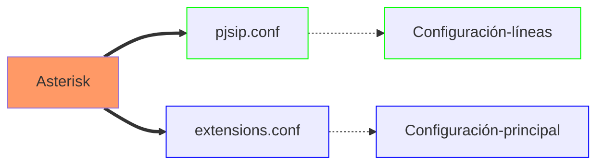

# PROGRAMACIÓN DE ASTERISK EN ĆONSOLA DE COMANDOS

- [PROGRAMACIÓN DE ASTERISK EN ĆONSOLA DE COMANDOS](#programación-de-asterisk-en-ćonsola-de-comandos)
  - [Arquitectura del protocolo SIP](#arquitectura-del-protocolo-sip)
    - [Contenido de un mensaje SIP](#contenido-de-un-mensaje-sip)
    - [Otros protocolos de señalización en telefonía IP](#otros-protocolos-de-señalización-en-telefonía-ip)
  - [Instalación y configuración de Asterisk Exchange](#instalación-y-configuración-de-asterisk-exchange)
  - [Ficherso de configuración en Asterisk Exchange](#ficherso-de-configuración-en-asterisk-exchange)

---

## Arquitectura del protocolo SIP

En la arquitectura del protocolo **SIP** los elementos situados en los extremos de la comunicación que intercambian métodos y respustas en una sesión se denominan _agentes de usuarios (UA)_ y puede adoptar tanto el papel de clientes (UAC) como el papel de servidores (UAS) dependiendo de si hacen peticiones o reciben peticiones.

Una sesión **SIP** puede ser iniciada, modificada y finalizada entre dos agentes de usuario sin que sea necesario ningún otro elemento intermedio en lo que se conoce como modo _peer-to-peer_, permitiendo efectuar una llamada telefónica entre dos teléfonos IP sin necesidad de centralita.

En el modo **peer to peer** es necesario que el teléfono que llama, conozca la dirección IP del teléfono con el que quiere iniciar la llamada.

**SIP** identifica a los usuarios por su URI (_Universal Resource Identifiers_) en la forma: `user@dominio/dirección IPv4:puerto`. Por ejemplo, para la extensión 101, que está en la dirección 192.168.1.180 su identificador sería: `101@192.168.1.180:5060`. Si no se especifica el número de puerto, se entiende que es 5060 UDP.

### Contenido de un mensaje SIP

Los mensajes SIP están escritos en código ASCII y su contenido se divide en dos partes: una cabecera del mensaje (_message header_) y un cuerpo del mensaje (_message body_).

Las partes más importantes de la cabecera de un mensaje SIP:

1. **Línea de comienzo**: si corresponde a un mensaje de petición o _request_ recibe el nombre de _request-line_ y si corresponde a un mensaje de respuesta recibe el nombre de _status-line_.
   - **Request-line**: contiene el tipo de mensaje SIP, en la forma `usuario_destino@dominio/dirección IPv4:puerto`.
   - **Status-line**: contiene la versión del protocolo SIP, el código numérico de respuesta y la frase o texto que lo identifica.
2. **Message Header**: indica el comienzo de cabecera.
   - **Via**: dirección IP donde se debe enviar la respuesta.
   - **Max-Forwards**: valor comprendido entre 0 y 255 que fija el número máximo de _Proxys_ que puede atravesar el mensaje.
   - **To**: identificación del receptor del mensaje en la forma, `usuario_destino@dominio`.
   - **From**: identificación del emisor del mensaje en la forma, `usuario_origen@dominio`.
   - **Cseq**: contiene un número entero que va aumentando en una unidad con cada nuevo mensaje que se envía. Junto con ese número también va un identificador del tipo de mensaje.
   - **Allow**: lista de métodos soportados por el agente de usuario que envía el mensaje, por ejemplo: INVITE, ACK, OPTIONS, CANCEL, BYE.
   - **Content-length**: número de bytes que ocupa el cuerpo del mensaje.

### Otros protocolos de señalización en telefonía IP

- **H.323**: es un protocolo creado inicialmente alrededor de 1995 para aplicaciones de videoconferencia sobre cualquier tipo de red de paquetes. Inconveniente con la telefonía sobre redes IP. H.232 cuenta, al igual que SIP, con unos elementos denominados _gatekeeper_ que permiten la traducción de identificadores de usuario a direcciones IP, el registro y su localización.
- **IAX** (_Inter-Asterisk Exchange_): IAX surge como respuesta a la complejidad de SIP y a las dificultades que tiene este protocolo para funcionar en redes protegidas por cortafuegos o con sistemas de traducción de direcciones de red NAT. IAX utiliza el puerto UDP 4569 para la señalización y para el envío del contenido multimedia de varias comunicaciones simultáneas.

## Instalación y configuración de Asterisk Exchange

[Instalación y configuración de Asterisk](https://agfhdg.wordpress.com/2021/05/05/freepbx-instalacion-y-configuracion/)

[Tera Term](https://teratermproject.github.io/index-en.html)

[Putty](https://www.putty.org/)

## Ficherso de configuración en Asterisk Exchange

Comprobar mediante el comando `systemctl status asterisk` que Asterisk está cargado y activo. En caso que no esté iniciado, ejecutar el comando `systemctl start asterisk` para iniciar el servicio.

En Asterisk se requiere de una configuración en el fichero **pjsip.conf** en la ruta **/etc/asterisk/** indicada. Una vez configuradas líneas y extensiones, es necesario configurar qué debe hacer Asterisk cada vez que, una de las extensiones marca un número, o cada vez que entra una llamada por una de las líneas IP, lo cual se lleva a cabo en el fichero **extensions.conf**, situado en el directorio **/etc/asterisk** y que es el fichero de configuración más importante de Asterisk.

Asterisk utiliza para diferenciar entre las diferentes líneas y extensiones los denominados **_context_** o contextos. Varias líneas o extensiones pueden estar en el mismo contexto si comparten las mismas propiedades, pero cada línea o extensiones solo puede estar en un único contexto.

Extensiones situadas en contextos diferentes producen un resultado distinto en Asterisk cuando marcan el mismo número y llamadas entrantes por diferentes líneas son enviadas a diferentes destinos en función del contexto donde se encuentra cada uno de los enlaces SIP.

Los ficheros **pjsip.conf** y **extensions.conf** están relacionados por los **context**. a líneas y extensiones se les asignan un _context_ en el fichero _pjsip.conf_ y en el fichero _extensions.conf_ se define que debe hacer Asterisk en cada uno de ellos.

El uso de **contextos** le da a Asterisk una gran flexibilidad sorprendente para realizar cualquier tipo de configuración con las líneas y extensiones.

El fichero **pjsip.conf** se utiliza únicamente, para la definición de líneas IP y extensiones IP con el protocolo SIP basado en el _driver_ de canal **chan_pjsip**.

Otros protocolos utilizan sus propios ficherso de configuración, como **iax.conf** para el protocolo IAX o sip.conf para el protocolo SIP, basado en el ya obsoleto driver de canal **chan_sip**.
