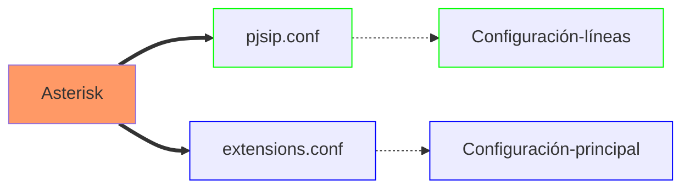

# PROGRAMACIÓN DE ASTERISK EN ĆONSOLA DE COMANDOS

- [PROGRAMACIÓN DE ASTERISK EN ĆONSOLA DE COMANDOS](#programación-de-asterisk-en-ćonsola-de-comandos)
  - [Arquitectura del protocolo SIP](#arquitectura-del-protocolo-sip)
    - [Contenido de un mensaje SIP](#contenido-de-un-mensaje-sip)
    - [Otros protocolos de señalización en telefonía IP](#otros-protocolos-de-señalización-en-telefonía-ip)
  - [Instalación y configuración de Asterisk Exchange](#instalación-y-configuración-de-asterisk-exchange)
  - [Ficheros de configuración en Asterisk Exchange](#ficheros-de-configuración-en-asterisk-exchange)
  - [Configuración del fichero pjsip.conf](#configuración-del-fichero-pjsipconf)
  - [Configuración del dialplan](#configuración-del-dialplan)

---

[Prácticas SIP](practic_sip/practicsip_01.md)
[Prácticas PJSIP](practic_pjsip/practpjsip.md)

---

## Arquitectura del protocolo SIP

En la arquitectura del protocolo **SIP** los elementos situados en los extremos de la comunicación que intercambian métodos y respustas en una sesión se denominan _agentes de usuarios (UA)_ y puede adoptar tanto el papel de clientes (UAC) como el papel de servidores (UAS) dependiendo de si hacen peticiones o reciben peticiones.

Una sesión **SIP** puede ser iniciada, modificada y finalizada entre dos agentes de usuario sin que sea necesario ningún otro elemento intermedio en lo que se conoce como modo _peer-to-peer_, permitiendo efectuar una llamada telefónica entre dos teléfonos IP sin necesidad de centralita.

En el modo **peer to peer** es necesario que el teléfono que llama, conozca la dirección IP del teléfono con el que quiere iniciar la llamada.

**SIP** identifica a los usuarios por su URI (_Universal Resource Identifiers_) en la forma: `user@dominio/dirección IPv4:puerto`. Por ejemplo, para la extensión 101, que está en la dirección 192.168.1.180 su identificador sería: `101@192.168.1.180:5060`. Si no se especifica el número de puerto, se entiende que es 5060 UDP.

### Contenido de un mensaje SIP

Los mensajes SIP están escritos en código ASCII y su contenido se divide en dos partes: una cabecera del mensaje (_message header_) y un cuerpo del mensaje (_message body_).

Las partes más importantes de la cabecera de un mensaje SIP:

1. **Línea de comienzo**: si corresponde a un mensaje de petición o _request_ recibe el nombre de _request-line_ y si corresponde a un mensaje de respuesta recibe el nombre de _status-line_.
   - **Request-line**: contiene el tipo de mensaje SIP, en la forma `usuario_destino@dominio/dirección IPv4:puerto`.
   - **Status-line**: contiene la versión del protocolo SIP, el código numérico de respuesta y la frase o texto que lo identifica.
2. **Message Header**: indica el comienzo de cabecera.
   - **Via**: dirección IP donde se debe enviar la respuesta.
   - **Max-Forwards**: valor comprendido entre 0 y 255 que fija el número máximo de _Proxys_ que puede atravesar el mensaje.
   - **To**: identificación del receptor del mensaje en la forma, `usuario_destino@dominio`.
   - **From**: identificación del emisor del mensaje en la forma, `usuario_origen@dominio`.
   - **Cseq**: contiene un número entero que va aumentando en una unidad con cada nuevo mensaje que se envía. Junto con ese número también va un identificador del tipo de mensaje.
   - **Allow**: lista de métodos soportados por el agente de usuario que envía el mensaje, por ejemplo: INVITE, ACK, OPTIONS, CANCEL, BYE.
   - **Content-length**: número de bytes que ocupa el cuerpo del mensaje.

### Otros protocolos de señalización en telefonía IP

- **H.323**: es un protocolo creado inicialmente alrededor de 1995 para aplicaciones de videoconferencia sobre cualquier tipo de red de paquetes. Inconveniente con la telefonía sobre redes IP. H.232 cuenta, al igual que SIP, con unos elementos denominados _gatekeeper_ que permiten la traducción de identificadores de usuario a direcciones IP, el registro y su localización.
- **IAX** (_Inter-Asterisk Exchange_): IAX surge como respuesta a la complejidad de SIP y a las dificultades que tiene este protocolo para funcionar en redes protegidas por cortafuegos o con sistemas de traducción de direcciones de red NAT. IAX utiliza el puerto UDP 4569 para la señalización y para el envío del contenido multimedia de varias comunicaciones simultáneas.

## Instalación y configuración de Asterisk Exchange

[Instalación y configuración de Asterisk](https://agfhdg.wordpress.com/2021/05/05/freepbx-instalacion-y-configuracion/)

[Tera Term](https://teratermproject.github.io/index-en.html)

[Putty](https://www.putty.org/)

## Ficheros de configuración en Asterisk Exchange

Comprobar mediante el comando `systemctl status asterisk` que Asterisk está cargado y activo. En caso que no esté iniciado, ejecutar el comando `systemctl start asterisk` para iniciar el servicio.

En Asterisk se requiere de una configuración en el fichero **pjsip.conf** en la ruta **/etc/asterisk/** indicada. Una vez configuradas líneas y extensiones, es necesario configurar qué debe hacer Asterisk cada vez que, una de las extensiones marca un número, o cada vez que entra una llamada por una de las líneas IP, lo cual se lleva a cabo en el fichero **extensions.conf**, situado en el directorio **/etc/asterisk** y que es el fichero de configuración más importante de Asterisk.

Asterisk utiliza para diferenciar entre las diferentes líneas y extensiones los denominados **_context_** o contextos. Varias líneas o extensiones pueden estar en el mismo contexto si comparten las mismas propiedades, pero cada línea o extensiones solo puede estar en un único contexto.

Extensiones situadas en contextos diferentes producen un resultado distinto en Asterisk cuando marcan el mismo número y llamadas entrantes por diferentes líneas son enviadas a diferentes destinos en función del contexto donde se encuentra cada uno de los enlaces SIP.

Los ficheros **pjsip.conf** y **extensions.conf** están relacionados por los **context**. a líneas y extensiones se les asignan un _context_ en el fichero _pjsip.conf_ y en el fichero _extensions.conf_ se define que debe hacer Asterisk en cada uno de ellos.

El uso de **contextos** le da a Asterisk una gran flexibilidad sorprendente para realizar cualquier tipo de configuración con las líneas y extensiones.

El fichero **pjsip.conf** se utiliza únicamente, para la definición de líneas IP y extensiones IP con el protocolo SIP basado en el _driver_ de canal **chan_pjsip**.

Otros protocolos utilizan sus propios ficherso de configuración, como **iax.conf** para el protocolo IAX o sip.conf para el protocolo SIP, basado en el ya obsoleto driver de canal **chan_sip**.

Se recomienda renombrar los ficheros **pjsip.conf** y **extensions.config** y realizar la configuración de la PBX sobre ficheros nuevos y sin contenido. Los pasos que hay que dar para trabajar sobre un fichero nuevo (_pjsip.conf_) son:

- Acceder al directorio **/etc/asterisk**.
- Copia el archivo _pjsip.conf_ a _pjsip.conf.old_: `cp pjsip.conf pjsip.conf.old`.
- Se puede realizar con el comando **mv** en lugar de **cp**.
- Editar el nuevo archivo _pjsip.conf_: `vim pjsip.conf`.

Sobre este nuevo fichero se introducen los parámetros de configuración deseados mediante el lenguaje de _script_ de Asterisk.

## Configuración del fichero pjsip.conf

El contenido se divide en secciones, encabezadas por el nombre de la sección entre corchetes y tanto en la configuración de las extensiones como en las líneas IP, utiliza un enfoque modular que permite reutilizar código común y separar a nivel lógico los diferentes parámetros de configuración, como puede ser el tipo de transporte (tcp, udp, tls) la autenticación o la identificación de la línea.

en la configuración son necesarias cuatro secciones:

1. Sección de tipo **endpoint**. Es la principal sección, el nombre debe ser igual al valor del campo _nombre del usuario_ de la extensión. En esta sección se define el contexto de la extensión, los códecs de voz utilizados y enlaces a las secciones de tipo _transport_, _aor_ y _auth_.
2. Sección de tipo **transport**: en esta sección se define la capa de transporte utilizada por la pila PJSIP con la extensión o el enlace SIP, la cual puede ser TCP, UDP, WebSockets y transporte encirptado del tráfico de voz mediante protocolos como TLS o SSL. Cuando varias extensiones comparten el mismo método de transporte, se puede compartir una sola sección _transport_ entre todas ellas.
3. Sección de tipo **aor**: aquí Asterisk encuentra los detalles de contacto de un _endpoint_ cuando tiene que enviarle una llamada. Asterisk puede obtener la dirección IP de un _endpoint_ de forma dinámica, a partir de la información del campo _contact_ en la sección de tipo _aor_. El parámetro _max_contacts_ indica el número de _endpoint_ diferentes que pueden ser registrados en la sección _aor_, ya que _pjsip_ permite registrar más de una extensión con el mismo número. El parámetro _remove_existing=yes_ en esta sección no es obligatorio, pero previene desconexiones no previstas de las extensiones. El acrónimo _aor_ significa _address of record_.
4. Sección de tipo **auth**: se definen los parámetros _username_ y _password_ de autenticación de la extensión en el registro. El valor de _username_ debe coincidir con el _nombre de autenticación_ asignado a la extensiones IP física o _softphone_.

En el fichero **pjsip.conf** las extensiones cuentan con: _endpoint_, _aor_ y _auth_ y se comparte en una única sección: _transport_.

Parámetros de interés en el fichero **pjsip.conf**:

- $\Phi$ **protocol=udp**: asignación del protocolo UDP para el funcionamiento de Asterisk.
- $\Phi$ **bind=0.0.0.0**: Asterisk atiende peticiones SIP desde cualquier dirección IP.
- $\Phi$ **disallow=all**: Asterisk desactiva todos los códecs de voz.
- $\Phi$ **allow=alaw**: Asterisk permite únicamente el códec alaw.

## Configuración del dialplan

El fichero **extensions.conf** se denomina también plan de marcación o _dialplan_ y es el fichero que le indica a Asterisk lo que debe hacer cuando una extensión marca un determinado número o cuando una llamada entra por una línea. Este fichero se encuentra en el directorio **/atc/asterisk**.

Se recomienta renombrarlo, los pasos para ello:

- $\Psi$ Acceder al directorio **/etc/asterisk**.
- $\Psi$ **mv extensions.conf extensions.conf.old**.
- $\Psi$ **vim extensions.conf**.

El fichero **extensions.conf** está subdividido en secciones, cuyo nombre se indica entre corchetes al comienzo de las mismas, y se corresponden con cada uno de los contextos definidos en el fichero **sip.conf**.

En cada sección del fichero **extensions.conf** se encuentran una serie de aplicaciones de Asterisk para ser ejecutadas de forma secuencial cada vez que desde una extensión se marca un determinado número o cada vez que entra una llamada por una determinada línea.

Las aplicaciones de Asterisk son propias de la telefonía y todas tienen un nombre que empiezan por mayúsculas y una serie de parámetros entre paréntesis.

| Aplicaciones | Descripción |
| :----------: | :---------- |
| Dial() | realiza una llamada telefónica |
| Playback() | reproduce un mensaje de audio |
| Record() | graba un mensaje de audio |
| Answer() | descuelga una llamada |
| SayNumber() | reproduce un audio con el valor de un número |
| MusicOnHold() | inicia la música en espera |
| MixMonitor() | graba una llamada |
| Hangup() | termina una llamada |

Asterisk cuenta con más de 200 aplicaciones distintas, donde la más importante es **Dial()**, ya que permite hacer llamadas.

- El _context_ evalúa las llamadas, ya que las extensiones tienen asignado \[llamadas-internas\].
- La palabra clave _exten_ seguida de los símbolos **=>**, indica a Asterisk que, a continuación, viene un número que puede ser marcado por alguno de los teléfonos del _context_.
- La cadena \_10[123] es un patrón de llamadas que indica a Asterisk un rango de números. Cualquier número que empiece por los dígitos 10 y a continuación el dígito 1, 2 0 3. Los números 101, 102, 103.
- El siguiente número del patrón, indica la **prioridad**, indicando el orden en el que deben ejecutarse las aplicaciones.
- La aplicación **Dial()** tiene dos parámetros: el primero indica que la llamada se debe hacer mediante el _driver_ del canal _pjsip_ y el segundo indica que se debe llamar al número almacenado en la variable **${EXTEN}**. Esta variable siempre contiene el último número marcado en Asterisk por cualquier de los teléfonos del _context_.
- La aplicación **Hangup()** se ejecuta en segundo lugar porque tiene prioridad 2 y le indica a Asterisk la finalización de las aplicaciones para el patrón de llamadas.

Cuando se modifica el dialplan es necesario recargarlo desde el CLI de Asterisk mediante el comando **dialplan reload**.