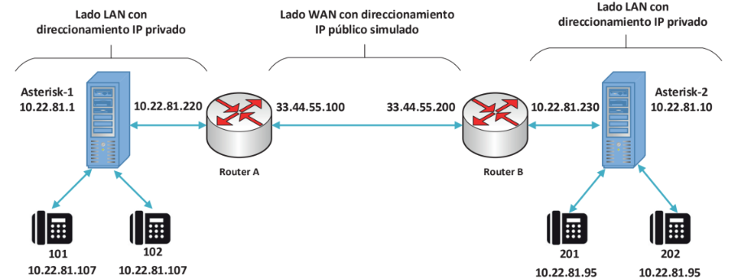

# PROGRAMACIÓN DE ASTERISK EN ĆONSOLA DE COMANDOS

- [PROGRAMACIÓN DE ASTERISK EN ĆONSOLA DE COMANDOS](#programación-de-asterisk-en-ćonsola-de-comandos)
  - [Arquitectura del protocolo SIP](#arquitectura-del-protocolo-sip)
    - [Contenido de un mensaje SIP](#contenido-de-un-mensaje-sip)
    - [Otros protocolos de señalización en telefonía IP](#otros-protocolos-de-señalización-en-telefonía-ip)
  - [Instalación y configuración de Asterisk Exchange](#instalación-y-configuración-de-asterisk-exchange)
  - [Ficheros de configuración en Asterisk Exchange](#ficheros-de-configuración-en-asterisk-exchange)
  - [Configuración del fichero pjsip.conf](#configuración-del-fichero-pjsipconf)
  - [Configuración del dialplan](#configuración-del-dialplan)
  - [La aplicación Dial()](#la-aplicación-dial)
    - [Options en la aplicación Dial()](#options-en-la-aplicación-dial)
      - [Conversión de audio MP3-WAV](#conversión-de-audio-mp3-wav)
      - [Límite de tiempo de llamada](#límite-de-tiempo-de-llamada)
      - [Mensaje de audio al comienzo de la llamada](#mensaje-de-audio-al-comienzo-de-la-llamada)
      - [Colgado de la llamada al cabo de n segundos](#colgado-de-la-llamada-al-cabo-de-n-segundos)
      - [Transferencia de llamadas](#transferencia-de-llamadas)
  - [Patrones de Marcado y Escritura Compacta del DIALPLAN()](#patrones-de-marcado-y-escritura-compacta-del-dialplan)
    - [Uso de la Variable ${EXTEN}](#uso-de-la-variable-exten)
    - [Selección de Dígitos en la Variable ${EXTEN}](#selección-de-dígitos-en-la-variable-exten)
    - [Aplicación SayNumber()](#aplicación-saynumber)
    - [Escritura compacta del Dialplan()](#escritura-compacta-del-dialplan)
    - [Aplicaciones NoOP() y Verbose()](#aplicaciones-noop-y-verbose)
  - [Música en Espera](#música-en-espera)
    - [Uso de Clases en la Aplicación MusicOnHold()](#uso-de-clases-en-la-aplicación-musiconhold)
      - [Instalar Paquetes de Audio en Español](#instalar-paquetes-de-audio-en-español)
  - [Buzones de Voz](#buzones-de-voz)
  - [Aplicaciones de Llamadas de Uso Común](#aplicaciones-de-llamadas-de-uso-común)
    - [Llamada Temporizada a Grupo de Extensiones](#llamada-temporizada-a-grupo-de-extensiones)
    - [Llamada a Múltipes Contactos por Extensión](#llamada-a-múltipes-contactos-por-extensión)
    - [Captura de Llamadas](#captura-de-llamadas)
    - [Captura Dirigida de Llamadas](#captura-dirigida-de-llamadas)
    - [Bifurcaciones, Variables y la Base de Datos de Asterisk](#bifurcaciones-variables-y-la-base-de-datos-de-asterisk)
    - [Base de Datos de Asterisk](#base-de-datos-de-asterisk)
    - [Configuración de Teclas BLF](#configuración-de-teclas-blf)
  - [Enlaces SIP en Asterisk](#enlaces-sip-en-asterisk)
    - [Enlace SIP Entre Dos Centralitas Asterisk](#enlace-sip-entre-dos-centralitas-asterisk)
    - [Enlace SIP a Través de Router](#enlace-sip-a-través-de-router)
  - [Enlace SIP con un Operador de VoIP](#enlace-sip-con-un-operador-de-voip)
  - [Configuración de una Operadora Automática](#configuración-de-una-operadora-automática)
  - [Extensiones invalid y timeout](#extensiones-invalid-y-timeout)

---

- [Prácticas SIP](practic_sip/practicsip_01.md)
- [Prácticas PJSIP](practic_pjsip/practpjsip.md)

---

## Arquitectura del protocolo SIP

En la arquitectura del protocolo **SIP** los elementos situados en los extremos de la comunicación que intercambian métodos y respustas en una sesión se denominan _agentes de usuarios (UA)_ y puede adoptar tanto el papel de clientes (UAC) como el papel de servidores (UAS) dependiendo de si hacen peticiones o reciben peticiones.

Una sesión **SIP** puede ser iniciada, modificada y finalizada entre dos agentes de usuario sin que sea necesario ningún otro elemento intermedio en lo que se conoce como modo _peer-to-peer_, permitiendo efectuar una llamada telefónica entre dos teléfonos IP sin necesidad de centralita.

En el modo **peer to peer** es necesario que el teléfono que llama, conozca la dirección IP del teléfono con el que quiere iniciar la llamada.

**SIP** identifica a los usuarios por su URI (_Universal Resource Identifiers_) en la forma: `user@dominio/dirección IPv4:puerto`. Por ejemplo, para la extensión 101, que está en la dirección 192.168.1.180 su identificador sería: `101@192.168.1.180:5060`. Si no se especifica el número de puerto, se entiende que es 5060 UDP.

### Contenido de un mensaje SIP

Los mensajes SIP están escritos en código ASCII y su contenido se divide en dos partes: una cabecera del mensaje (_message header_) y un cuerpo del mensaje (_message body_).

Las partes más importantes de la cabecera de un mensaje SIP:

1. **Línea de comienzo**: si corresponde a un mensaje de petición o _request_ recibe el nombre de _request-line_ y si corresponde a un mensaje de respuesta recibe el nombre de _status-line_.
   - **Request-line**: contiene el tipo de mensaje SIP, en la forma `usuario_destino@dominio/dirección IPv4:puerto`.
   - **Status-line**: contiene la versión del protocolo SIP, el código numérico de respuesta y la frase o texto que lo identifica.
2. **Message Header**: indica el comienzo de cabecera.
   - **Via**: dirección IP donde se debe enviar la respuesta.
   - **Max-Forwards**: valor comprendido entre 0 y 255 que fija el número máximo de _Proxys_ que puede atravesar el mensaje.
   - **To**: identificación del receptor del mensaje en la forma, `usuario_destino@dominio`.
   - **From**: identificación del emisor del mensaje en la forma, `usuario_origen@dominio`.
   - **Cseq**: contiene un número entero que va aumentando en una unidad con cada nuevo mensaje que se envía. Junto con ese número también va un identificador del tipo de mensaje.
   - **Allow**: lista de métodos soportados por el agente de usuario que envía el mensaje, por ejemplo: INVITE, ACK, OPTIONS, CANCEL, BYE.
   - **Content-length**: número de bytes que ocupa el cuerpo del mensaje.

### Otros protocolos de señalización en telefonía IP

- **H.323**: es un protocolo creado inicialmente alrededor de 1995 para aplicaciones de videoconferencia sobre cualquier tipo de red de paquetes. Inconveniente con la telefonía sobre redes IP. H.232 cuenta, al igual que SIP, con unos elementos denominados _gatekeeper_ que permiten la traducción de identificadores de usuario a direcciones IP, el registro y su localización.
- **IAX** (_Inter-Asterisk Exchange_): IAX surge como respuesta a la complejidad de SIP y a las dificultades que tiene este protocolo para funcionar en redes protegidas por cortafuegos o con sistemas de traducción de direcciones de red NAT. IAX utiliza el puerto UDP 4569 para la señalización y para el envío del contenido multimedia de varias comunicaciones simultáneas.

## Instalación y configuración de Asterisk Exchange

[Instalación y configuración de Asterisk](https://agfhdg.wordpress.com/2021/05/05/freepbx-instalacion-y-configuracion/)

[Tera Term](https://teratermproject.github.io/index-en.html)

[Putty](https://www.putty.org/)

## Ficheros de configuración en Asterisk Exchange

Comprobar mediante el comando `systemctl status asterisk` que Asterisk está cargado y activo. En caso que no esté iniciado, ejecutar el comando `systemctl start asterisk` para iniciar el servicio.

En Asterisk se requiere de una configuración en el fichero **pjsip.conf** en la ruta **/etc/asterisk/** indicada. Una vez configuradas líneas y extensiones, es necesario configurar qué debe hacer Asterisk cada vez que, una de las extensiones marca un número, o cada vez que entra una llamada por una de las líneas IP, lo cual se lleva a cabo en el fichero **extensions.conf**, situado en el directorio **/etc/asterisk** y que es el fichero de configuración más importante de Asterisk.


Asterisk utiliza para diferenciar entre las diferentes líneas y extensiones los denominados **_context_** o contextos. Varias líneas o extensiones pueden estar en el mismo contexto si comparten las mismas propiedades, pero cada línea o extensiones solo puede estar en un único contexto.

Extensiones situadas en contextos diferentes producen un resultado distinto en Asterisk cuando marcan el mismo número y llamadas entrantes por diferentes líneas son enviadas a diferentes destinos en función del contexto donde se encuentra cada uno de los enlaces SIP.

Los ficheros **pjsip.conf** y **extensions.conf** están relacionados por los **context**. a líneas y extensiones se les asignan un _context_ en el fichero _pjsip.conf_ y en el fichero _extensions.conf_ se define que debe hacer Asterisk en cada uno de ellos.


El uso de **contextos** le da a Asterisk una gran flexibilidad sorprendente para realizar cualquier tipo de configuración con las líneas y extensiones.

El fichero **pjsip.conf** se utiliza únicamente, para la definición de líneas IP y extensiones IP con el protocolo SIP basado en el _driver_ de canal **chan_pjsip**.

Otros protocolos utilizan sus propios ficherso de configuración, como **iax.conf** para el protocolo IAX o sip.conf para el protocolo SIP, basado en el ya obsoleto driver de canal **chan_sip**.

Se recomienda renombrar los ficheros **pjsip.conf** y **extensions.config** y realizar la configuración de la PBX sobre ficheros nuevos y sin contenido. Los pasos que hay que dar para trabajar sobre un fichero nuevo (_pjsip.conf_) son:

- Acceder al directorio **/etc/asterisk**.
- Copia el archivo _pjsip.conf_ a _pjsip.conf.old_: `cp pjsip.conf pjsip.conf.old`.
- Se puede realizar con el comando **mv** en lugar de **cp**.
- Editar el nuevo archivo _pjsip.conf_: `vim pjsip.conf`.

Sobre este nuevo fichero se introducen los parámetros de configuración deseados mediante el lenguaje de _script_ de Asterisk.

## Configuración del fichero pjsip.conf

El contenido se divide en secciones, encabezadas por el nombre de la sección entre corchetes y tanto en la configuración de las extensiones como en las líneas IP, utiliza un enfoque modular que permite reutilizar código común y separar a nivel lógico los diferentes parámetros de configuración, como puede ser el tipo de transporte (tcp, udp, tls) la autenticación o la identificación de la línea.

en la configuración son necesarias cuatro secciones:

1. Sección de tipo **endpoint**. Es la principal sección, el nombre debe ser igual al valor del campo _nombre del usuario_ de la extensión. En esta sección se define el contexto de la extensión, los códecs de voz utilizados y enlaces a las secciones de tipo _transport_, _aor_ y _auth_.
2. Sección de tipo **transport**: en esta sección se define la capa de transporte utilizada por la pila PJSIP con la extensión o el enlace SIP, la cual puede ser TCP, UDP, WebSockets y transporte encirptado del tráfico de voz mediante protocolos como TLS o SSL. Cuando varias extensiones comparten el mismo método de transporte, se puede compartir una sola sección _transport_ entre todas ellas.
3. Sección de tipo **aor**: aquí Asterisk encuentra los detalles de contacto de un _endpoint_ cuando tiene que enviarle una llamada. Asterisk puede obtener la dirección IP de un _endpoint_ de forma dinámica, a partir de la información del campo _contact_ en la sección de tipo _aor_. El parámetro _max_contacts_ indica el número de _endpoint_ diferentes que pueden ser registrados en la sección _aor_, ya que _pjsip_ permite registrar más de una extensión con el mismo número. El parámetro _remove_existing=yes_ en esta sección no es obligatorio, pero previene desconexiones no previstas de las extensiones. El acrónimo _aor_ significa _address of record_.
4. Sección de tipo **auth**: se definen los parámetros _username_ y _password_ de autenticación de la extensión en el registro. El valor de _username_ debe coincidir con el _nombre de autenticación_ asignado a la extensiones IP física o _softphone_.

En el fichero **pjsip.conf** las extensiones cuentan con: _endpoint_, _aor_ y _auth_ y se comparte en una única sección: _transport_.

Parámetros de interés en el fichero **pjsip.conf**:

- $\Phi$ **protocol=udp**: asignación del protocolo UDP para el funcionamiento de Asterisk.
- $\Phi$ **bind=0.0.0.0**: Asterisk atiende peticiones SIP desde cualquier dirección IP.
- $\Phi$ **disallow=all**: Asterisk desactiva todos los códecs de voz.
- $\Phi$ **allow=alaw**: Asterisk permite únicamente el códec alaw.

## Configuración del dialplan

El fichero **extensions.conf** se denomina también plan de marcación o _dialplan_ y es el fichero que le indica a Asterisk lo que debe hacer cuando una extensión marca un determinado número o cuando una llamada entra por una línea. Este fichero se encuentra en el directorio **/atc/asterisk**.

Se recomienta renombrarlo, los pasos para ello:

- $\Psi$ Acceder al directorio **/etc/asterisk**.
- $\Psi$ **mv extensions.conf extensions.conf.old**.
- $\Psi$ **vim extensions.conf**.

El fichero **extensions.conf** está subdividido en secciones, cuyo nombre se indica entre corchetes al comienzo de las mismas, y se corresponden con cada uno de los contextos definidos en el fichero **sip.conf**.

En cada sección del fichero **extensions.conf** se encuentran una serie de aplicaciones de Asterisk para ser ejecutadas de forma secuencial cada vez que desde una extensión se marca un determinado número o cada vez que entra una llamada por una determinada línea.

Las aplicaciones de Asterisk son propias de la telefonía y todas tienen un nombre que empiezan por mayúsculas y una serie de parámetros entre paréntesis.

| Aplicaciones | Descripción |
| :----------: | :---------- |
| Dial() | realiza una llamada telefónica |
| Playback() | reproduce un mensaje de audio |
| Record() | graba un mensaje de audio |
| Answer() | descuelga una llamada |
| SayNumber() | reproduce un audio con el valor de un número |
| MusicOnHold() | inicia la música en espera |
| MixMonitor() | graba una llamada |
| Hangup() | termina una llamada |

Asterisk cuenta con más de 200 aplicaciones distintas, donde la más importante es **Dial()**, ya que permite hacer llamadas.


- El _context_ evalúa las llamadas, ya que las extensiones tienen asignado \[llamadas-internas\].
- La palabra clave _exten_ seguida de los símbolos **=>**, indica a Asterisk que, a continuación, viene un número que puede ser marcado por alguno de los teléfonos del _context_.
- La cadena \_10[123] es un patrón de llamadas que indica a Asterisk un rango de números. Cualquier número que empiece por los dígitos 10 y a continuación el dígito 1, 2 0 3. Los números 101, 102, 103.
- El siguiente número del patrón, indica la **prioridad**, indicando el orden en el que deben ejecutarse las aplicaciones.
- La aplicación **Dial()** tiene dos parámetros: el primero indica que la llamada se debe hacer mediante el _driver_ del canal _pjsip_ y el segundo indica que se debe llamar al número almacenado en la variable **${EXTEN}**. Esta variable siempre contiene el último número marcado en Asterisk por cualquier de los teléfonos del _context_.
- La aplicación **Hangup()** se ejecuta en segundo lugar porque tiene prioridad 2 y le indica a Asterisk la finalización de las aplicaciones para el patrón de llamadas.

Cuando se modifica el dialplan es necesario recargarlo desde el CLI de Asterisk mediante el comando **dialplan reload**.

---

## La aplicación Dial()

Es la más importante de Asterisk y su función es realizar llamadas. La aplicación **Dial()** tiene los parámetros: `Dial(Tecnología/Recurso, timeout, [options, [URL]])`.

- **Tecnología/Recurso**: indica el driver de la llamada, en este caso el driver _pjsip_.
- **URI**: indica la URI de destino de la llamada. En este caso la URI es el número marcado.
- El parámetro **${EXTEN}** indica el número marcado.
- El parámetro **timeout** indica el tiempo de espera de la llamada. En este caso el tiempo es de 10 segundos.
- El parámetro **options** indica el comportamiento de la llamada. Con funciones como: reproducir audio, grabar audio, descolgar la llamada, limitar la duración de una llamada, activar la musica en espera, etc.

La aplicación **Dial()** se puede utilizar en su forma básica, sin ningún parámetro opcional. El parámetro **timeout** establece el número de segundos durantel cual se envía la llamada al destino, finalizando de forma automática si no es descolgada en el tiempo indicado.

")

```asterisk
[operadora]

exten => 102,1,Dial(pjsip/${EXTEN},10)
 same => n,Hangup()

[trabajadores]

exten => 101,1,Dial(pjsip/${EXTEN},10)
 same => n,Hangup()
```

### Options en la aplicación Dial()

La aplicación **Dial()** cuenta con un amplio conjunto de opciones para el comportamiento de la llamada.

- **m**: activa la música en espera a la parte llammante hasta que la parte llamada descuelga la llamada.
- **L(x[:y][:z])**: limita la duración de la llamada, enviando unos mensajes de aviso cuando falta un cierto tiempo para la finalización. El parámetro **x** indica el tiempo en segundos. El parámetro **y** indica el tiempo en minutos. El parámetro **z** indica el tiempo en horas.
- **A(x)**: reproduce el mensaje de audio especificado por **x** a la parte llamada.
- **S(n)**: cuelga la llamada **n** segundos después de haber sido descolgada.
- **T**: permite transferir una llamada al usuario que la ha iniciado.
- **t**: permite transferir una llamada al usuario que la ha recibido.

Mediante el comando `core show application dial` podemos consultar las opciones disponibles.

Ejemplo de extensión haciendo uso de la música en espera, configuración vállida para _pjsip.conf_:

```asterisk
[internas]

exten => 102,1,Dial(pjsip/${EXTEN},10,m)
 same => n,Hangup()
```

El archivo de audio que se reproduce es uno de los cinco instalados por defecto durante la compilación de Asterisk. Estos ficheros están en formato _wav_ en la ruta: `/var/lib/asterisk/moh`.

Para consultar la lista completa de formatos de audio soportados: `core show file formats`.

Asterisk reproduce el audio por orden alfabético inverso. Para la reproducción aleatorio se elimina la línea `sort=random` incluida en el archivo `musiconhold.conf` en la ruta `/etc/asterisk/musiconhold.conf`. Una vez modificado el fichero, se debe reiniciar ejecutando el comando `moh reload`.

> [!tip]
> Los archivos de audio se recomiendan en formato wav.

#### Conversión de audio MP3-WAV

**SoX (Sound eXchange)** permite convertir ficheros de audio **mp3** a formato **wav**.

- Instalar la aplicación **SoX**: `sudo apt-get install sox libsox-fmt-all`.
- Copiar los archivos de audio _mp3_ al directorio: `/var/lib/asterisk/moh`.
- Ejecutar desde el directorio `/var/lib/asterisk/moh` el comando `sox *.mp3 -c1 -r 8000 *.wav`.

El parámetro **-c1** indica el número de canales de audio (mono). El parámetro **-r 8000** indica la frecuencia de muestreo en Hz.

> [!NOTE]
>
> La música en espera en formato wav para los teléfonos debe estar en formato mono PCM 16 bits y 800 Hz.
>
> El códec G711 alaw utilizado también tiene 800 Hz de frecuencia de muestreo, con 8 bits y cuantificación no uniforme.

#### Límite de tiempo de llamada

La opción `L(x[:y][:z])` en la aplicación **Dial()** finaliza una llamada al cabo de un tiempo determinado, enviando previamente avisos mediante diferentes mensajes de audio.

- **x**: tiempo de duración de la llamada (ms). La llamada finaliza automáticamente al cumplirse este tiempo.
- **y**: tiempo de envío del mensaje de preaviso (ms). Se envía un mensaje de preaviso cuando falta este tiempo para la finalización de la llamda.
- **z**: tiempo de repetición del mensaje de preaviso (ms). El mensaje se repite cada vez que se cumple este tiempo.

Ejemplo de código en el fichero _extensions.conf_:

```conf
[operadora]

exten => 102,1,Dial(PJSIP/102,20)
exten => 102,2,Hangup()

exten => 103,1,Dial(PJSIP/103,20)
exten => 103,2,Hangup()

exten => 104,1,Dial(PJSIP/104,20)
exten => 104,2,Hangup()

exten => 8,1,Dial(PJSIP/102&PJSIP/103&PJSIP/104,30)
exten => 8,2,Hangup()

[trabajadores]

exten => 9,1,Dial(PJSIP/101,20,mL(6000:15000:5000))
exten => 9,3,Hangup()
;6000 límite de tiempo de llamada (60 seg.)
;15000 tiempo de preaviso (15 seg)
;5000 tiempo de repetición de preaviso (5 seg.)
```

Asterisk utiliza para el preaviso de finalización de llamada y para la repetición del preaviso el mensaje denominado _vm-youhave_. Estos mensajes se pueden grabar mediante la aplicación **Record()** y se incluyen en el _dialplan_ asignando la aplicación **Set()** los nombres de los ficheros de audio para reproducir a las siguientes variables:

- **LIMIT_WARNING_FILE= filename**: especifica el fichero de audio de preaviso de finalización de llamada y de repetición del preaviso.
- **LIMIT_CONNECT_FILE= filename**: especifica el fichero de audio que se reproduce al comenzar la llamada.

Ejemplo de grabación de los dos mensajes de audio se realiza desde la extensión situada en el contexto de operadora mediante los números 661 y 662. Al finalizar la grabación es necesario presionar la tecla `#` para que el mensaje quede guardado en el directorio indicado.

Código del archivo _extensions.conf_ para el mensaje de audio personalizados en el límite de tiempo de llamada:

```conf
;con Record() se debe indicar el formato
exten => 661,1,Record(/var/lib/asterisk/sounds/es/AvisoLimite:wav)
exten => 661,2,Hangup()

exten => 662,1,Record(/var/lib/asterisk/sounds/es/AvisoLimite:wav)
exten => 662,2,Hangup()

[trabajadores]
exten => 9,1,Answer(1000)
exten => 9,2,Set(LIMIT_CONNECT_FILE=/var/lib/asterisk/sounds/es/AvisoLimite)
exten => 9,3,Set(LIMIT_WARNING_FILE=/var/lib/asterisk/sounds/es/Preaviso)
exten => 9,4,Dial(PJSIP/101,20,mL(20000:10000:5000))
exten => 9,5,Hangup()
```

El directorio `/var/lib/asterisk/sounds/es` elegido para almacenar estos mensajes de audio. Es también el directorio para almacenar los mensajes de audio del sistema en español.

#### Mensaje de audio al comienzo de la llamada

Con la opción `A(x)` en la aplicación `Dial()`, se puede reproducir un mensaje de audio al comienzo de la llamada. Indicado por el parámetro _x_ cuando el usuario llamado descuelga la llamada. Ejemplo de mensaje de audio: "Le recordamos que por su seguridad esta llamada puede ser grabada".

Fichero _extensions.conf_:

```conf
[operadora]

exten => 102,1,Dial(PJSIP/102,20)
exten => 102,2,Hangup()

exten => 103,1,Dial(PJSIP/103,20)
exten => 103,2,Hangup()

exten => 104,1,Dial(PJSIP/104,20)
exten => 104,2,Hangup()

exten => 8,1,Dial(PJSIP/102&PJSIP/103&PJSIP/104,30)
exten => 8,2,Hangup() 

exten => 661,1,Record(/var/lib/asterisk/sounds/es/AvisoLimite:wav)
exten => 661,2,Hangup()

[trabajadores]

exten => 9,1,Answer(1000)
exten => 9,2,Dial(PJSIP/101,20,mA(/var/lib/asterisk/sounds/es/AvisoLimite))
exten => 9,3,Hangup()
;mA = mensaje de audio al descolgar la llamada
```

#### Colgado de la llamada al cabo de n segundos

Con la opción `S(n)` en la aplicación `Dial()`, se puede colgar la llamada al cabo de un tiempo determinado. Indicado por el parámetro _n_ en segundos. Se usa habitualmente para reproducir un mensaje de audio al usuario llamado y colgar la llamada a continuación.

```conf
[trabajadores]

exten => 9,1,Answer(1000)
exten => 9,2,Dial(PJSIP/101,20,mS(/var/lib/asterisk/sounds/es/MensajeGrabLlamado)S(2))
exten => 9,3,Hangup()
;S(2) = colgar la llamada al cabo de 2 segundos
```

#### Transferencia de llamadas

Las transferencias de llamadas en Asterisk se configuran mediante dos _options_ de la aplicación **Dial()**.

- **T:** el usuario que ha iniciado una llamada puede transferirla a otra expresión.
- **t:** el usuario que ha recibido una llamada puede transferirla a otra extensión.

La transferencias pueden ser de dos tipos diferentes:

- _**Blind Transfer**_ (transferencia ciega)
- _**Attended Transfer**_ (transferencia atendida)

Los códigos que se deben marcar para realizar ambos tipos de transferencias se configuran en la sección **[featuremap]** del fichero _features.conf_ situado en el directorio `/etc/asterisk`.

```conf
[featuremap]
;bliddxfer => #1 ---> código para la transferencia ciega. Por defecto es #
;disconnect => *0
;automon => *1
;atxfer => *2 -----> código para la tranaferencia atendida.
;parkcall => #72
;automixmon => *3
```

Los cambios en el fichero _features.conf_ se recargan mediante el comando de consola _reload features_.

Ejemplo donde las extensiones que realizan una llamada pueden transferirla y también pueden hacerlo las extensiones que las reciben.

```conf
[extensiones-empresa]

exten => 101,1,Dial(PJSIP/101,20,tT)
exten => 101,2,Hangup()

exten => 102,1,Dial(PJSIP/102,20,tT)
exten => 102,2,Hangup()

exten => 103,1,Dial(PJSIP/103,20,tT)
exten => 103,2,Hangup()

exten => 104,1,Dial(PJSIP/104,20,tT)
exten => 104,2,Hangup()
```

La transferencia de llamadas es una de las funciones más utilizadas en las centralitas. El funcionamiento de las transferencias atendidas se puede ajustar mediante unas variables que existen en la sección **[general]** del fichero **features.conf** entre ellas **atxfernoanswertimeout**, que determina el tiempo que espera Asterisk para que la transferencia sea atendida antes de devolver la llamada a la extensión que la inicia (por defecto quince segundos) **atxferloopdelay** que determina el tiempo de espera antes de volver a reintentar la transferencia (por defecto, diez segundos) o **atxfercallbackretries** que fija el número de veces que se intenta de nuevo la transferencia (por defecto, dos veces)

> Asterisk necesita que el flujo de audio RTP de una llamada pase a través de él para detectar peticiones de transferencia y esto lo hace de forma automática cuando detecta en una aplicación Dial() cualquiera de las opciones de transferencia de llamadas (option tT). El parámetro direct_media=no en el fichero pjsip.conf también hace que el flujo RTP pase a través de Asterisk

Las señales DTMF correspondientes a los números marcados por las extensiones cuando solicitan una transferencia de llamadas, pueden ser enviadas de tres formas distintas hacia Asterisk:

1. **In band**: la señalización DTMF es codificada y enviada en forma de paquetes RTP, de la misma manera que la señal de audio. Este sistema funciona bien con los _códecs_ de forma de onda, como _alaw_ y _ulaw_, pero falla con los _códecs_ de tipo paramétrico e híbrido, ya que estos no trabajan correctamente con señales diferentes a la voz humana.
2. **Info**: la señalización DTMF se envía en mensajes SIP de tipo INFO. Este sistema no garantiza la reproducción de estas señales en el receptor en tiempo real, lo cual es un problema importante, ya que este tipo de señalización analógica tiene requisitos de temporización muy estrictos.
3. **RFC 2833**: se generan paquetes RTP específicos con la descripción de los diferentes tonos DTMF enviados; se envían junto con los paquetes RTP de audio. Este sistema necesita que ambos extremos sean compatibles con el estándar, pero garantiza la reproducción en tiempo real de estos tonos en el receptor, siendo éste, el sistema  elegido por defecto en Asterisk. Actualmente el estándar RFC 2833 ha sido sustituido por el RFC 4733, aunque son muchos los teléfonos SIP que siguen implementando el estándar RFC 2833.

Cuando una extensión inicia una llamada, el número marcado se transmite de forma digital dentro de un mensaje SIP, pero cuando la llamada está ya iniciada, cualquier pulsación del teclado del teléfono debe transmitirse como señal DTMF porque en esos momentos ya solo hay flujo de audio en forma de paquetes RTP.

---

## Patrones de Marcado y Escritura Compacta del DIALPLAN()

Los patrones de marcado permiten a Asterisk identificar números marcados dentro de un determinado rango de valores, simplificando en gran manera la escritura del _dialplan_.

> [!TIP]
>
> El patrón de marcado siempre comienza en el símbolo de guión bajo.

| Símbolos | Explicación |
| **X** | un dígito del 0 al 9 |
| **Z** | un dígito del 1 al 9 |
| **N** | un dígito del 2 al 9 |
| **.** | uno o más dígitos |
| **!** | cero o más dígitos |

Ejemplos:

- `_6XX` &rarr; número de tres dígitos que empieza por 6.
- `_6XX!` &rarr; número de tres o más dígitos que comienzan por 6.
- `_655.` &rarr; número de cuatro o más dígitos que comienzan por 6.
- `_10[2345]` &rarr; cualquiera de los números 102, 103, 104 o 105.
- `_[3-789]` &rarr; cualquiera de los dígitos 3, 7, 8 o 9.
- `_[89][1-8]XXXXXXX` &rarr; número de nueve cifras, comienza por 8 o 9 y cuyo segundo dígito es uno comprendido entre 1 y 8.

### Uso de la Variable ${EXTEN}

La variable `${EXTEN}` em Asterisk permite que la aplicación **Dial()** llame al número marcado en un patrón. Esta variable se escribe entre llaves, en mayúsculas y precedida por el símbolo **$**.

`${EXTEN}` es una de las más usadas en el _dialplan_ y contiene en todo momento el último número marcado por alguna de las extensiones dentro del _context_. Esta variable sustituye al destino de una aplicación **Dial()** cuando hay un patrón de marcado.

```asterisk
[extensiones]

exten => _10[1234],1,Dial(PJSIP/${EXTEN},20,tT)
exten => _10[1234],2,Hangup()
```

### Selección de Dígitos en la Variable ${EXTEN}

Cuando se utiliza `${EXTEN}` a veces es necesario seleccionar determinados dígitos de la variable, como por ejemplo, cuando el usuario debe marcar un código para acceder a línea externa, pero ese código no debe ser marcado hacia el operador.

Asterisk permite seleccionar determinados dígitos o caracteres de la variable `${EXTEN}` mediante un par de valores que indican el _offset_ y el número de dígitos que se han de seleccionar. Por ejemplo: **${EXTEN:x:y}**, donde:

- **x** es el _offset_ o punto de la variable donde empiezan los dígitos útiles. Si el _offset_ es un número negativo, se empieza a contar por el último dígito de la variable.
- **y** es el número de dígitos que se han de seleccionar. Si no se indica nada, se selecciona hasta el final de la variable.

Ejemplo, si el número marcado es 83102 entonces:

- `${EXTEN:2}` devuelve el número 102.
- `${EXTEN:1}` devuelve el número 3102.
- `${EXTEN:-3}` devuelve el número 102.
- `${EXTEN:1:3}` devuelve el número 310.

### Aplicación SayNumber()

Los patrones de marcado y la variable **${EXTEN}** pueden utilizarse junto a la aplicación **SayNumber()** para reproducir antes de la llamada el número que ha marcado el usuario.

La aplicación **SayNumber()** reproduce en un mensaje de audio el número que se le pasa como argumento, que puede ser un número absoluto o, cuando se utilizan patrones de llamada, el número definido por la variable **${EXTEN}**.

Ejemplo de uso de variable `${EXTEN}` junto con la aplicación `SayNumber()`.

```asterisk
[extensiones-empresa]

exten => _10[1234],1,Answer(500)
exten => _10[1234],2,SayNumber(${EXTEN})
exten => _10[1234],3,Dial(PJSIP/${EXTEN},20,tT)
exten => _10[1234],4,Hangup()
```

La aplicación **SayNumber()** requiere que la extensión descuelgue la llamada para lo cual se emplea la aplicación **Answer()**. Se aconseja una corta temporización para dar tiempo a la extensión a que se descuelgue la llamada, y evitar cortes de audio en la parte inicial del mensaje reproducido.

### Escritura compacta del Dialplan()

El procedimiento abreviado de escritura de las prioridades, consiste en sustituir todos los valores numéricos de prioridades, excepto el primero, por la palabra clave **_next_** o su abreviatura **_n_**. Asterisk coloca de forma automática el número de prioridad a cada línea y a cualquier nueva línea insertada.

Ejemplo de escritura simplificada (usando _n_) de las prioridades en el **Dialplan()**:

```asterik
[extensiones-empresa]

exten => _10[1234],1,Answer(500)
exten => _10[1234],n,SayNumber(${EXTEN})
exten => _10[1234],n,Dial(PJSIP/${EXTEN},20,tT)
exten => _10[1234],n,Hanhup()
```

Asterisk también simplifica la escritura del _dialplan_ mediante el uso de la palabra clave **_same_**.

Ejemplo de simplificación de la escritura de los patrones de marcada usando _same_:

```asterisk
[extensiones-empresa]

exten => _10[1234],1,Answer(500)
same => n,SayNumber(${EXTEN})
same => n,Dial(PJSIP/${EXTEN},20,tT)
same => n,Hangup()
```

En el _dialplan_ se pueden incluir comentarios. Un comentario es todo aquello que sigue al símbolo punto y coma`;`, y se pueden poner tantos como se estime conveniente.

### Aplicaciones NoOP() y Verbose()

Asterisk cuenta con dos aplicaciones para facilitar la depuración de errores en el _dialplan_.

- **NoOp(texto)**: muestra en el CLI el comentario o frase indicada entre paréntesis y se utiliza frecuentemente para la depuración de errores. El nivel de _verbose_ es 3 o superior. Este nivel puede ajustarse mediante el comando `core set verbose "nivel-verbose"`.
- **Verbose(nivel, texto)**: hace la misma función, pero permite fijar el nivel de _verbose_, siendo más flexible y estando recomendado su uso.

Asterisk muestra en el CLI dos tipos de mensajes diferentes para la depuración de errores. Los mensajes de tipo _versbose_ y los mensajes de tipo _debug_.

- _Mensaje de tipo verbose_: dan información sobre las llamadas, así como mensajes de tipo warning o error. Con un nivel 0 de Verbose la información que se muestra es mínima, mientras que con un nivel de Verbose igual a 3 se muestra toda la información de la llamada. Son muy pocos los mensajes que puedan aparecer con un nivel de Verbose superior a 3.
- _Mensajes de tipo debug_: dan información sobre el propio sistema Asterisk y son utilizados preferentemente por los desarrolladores cuando intentan buscar errores en el código. El nivel de debug se modifica desde el CLI de Asterisk mediante el comando `core set debug "nivel-debug"`.

Para visualizar los mensajes de debug en la consola de Asterisk es necesario modificar en el fichero _logger.conf_ la línea: `console => notice.warning.error` por la línea: `console => notice.warning.error.debug` y recargar el fichero mediante el comando: `logger reload`.

Al finalizar la tarea de _debug_ se debe desactivar los cambios efectuados, ya que la función activada influye directamente en el rendimiento y en el tamaño de los ficheros de _log_ generados automáticamente.

## Música en Espera

Asterisk reproduce música en espera con la opción **m** en la aplicación **Dial()** en el transcurso de la llamada.

Otra opción es usar la aplicación **MusicOnHold()** para reproducir música a voluntad mediante la marcación de un número o código de función asignado a la misma. La aplicación **MusicOnHold()** envía un archivo de audio a una extensión para su reproducción, siendo necesario que la extensión esté preparada para recibir y reproducir e archivo mediante la aplicación **Answer()**.

> [!NOTE]
>
> La aplicación **MusicOnHold()** requiere de terminales con el sistema de manos libres.

Ejemplo de aplicaciones **MusicOnHold()** y **Answer()**:

```asterisk
[operadora]

exten => 102,1,Dial(PJSIP/102,20)
exten => 102,2,Hangup()

exten => 103,1,Dial(PJSIP/103,20)
exten => 103,2,Hangup()

exten => 104,1,Answer(500)
exten => 104,2,MusicOnHold(103)

exten => 8,1,Dial(PJSIP/102&PJSIP/103&PJSIP/104,30)
exten => 8,2,Hangup()

exten => 55,1,Answer(500)
exten => 55,2,MusicOnHold(103)
exten => 55,3,Hangup()

[trabajadores]

exten => 9,1,Dial(PJSIP/101,20,m)
exten => 9,2,Hangup()
```

La aplicación _Answer()_ descuelga la llamada y pasa inmediatamente el control a la siguiente aplicación en el _dialplan_. Es recomendable asignar un _delay_ o tiempo de espera a la aplicación _Answer(500)_ (valor en ms) de espera antes de que Asterisk ejecute la siguiente aplicación en el _dialplan_.

### Uso de Clases en la Aplicación MusicOnHold()

Las clases de Asterisk se pueden utilizar en la aplicación **MusicOnHold()** para reproducir las melodías en espera. En función del número marcado, se reproducirán distintos archivos de audio de una u otra clase.

El proceso de configuración comienza con la creación de un directorio en `/var/lib/asterisk/moh` para cada una de las clases que se van a implementar.

En el fichero de configuración `_musiconhold.conf_` se indican las clases y los archivos de audio que se deben reproducir. Los nombres deben coincidir con los asignados a los directorios creados.

Ejemplo de clases en el fichero _musiconhold.conf_:

```asterisk
[default]
mode=files
directory=moh

[blues] ;este nombre de directorio debe existir en la ruta /var/lib/asterisk/moh
mode=files
directory=/var/lib/asterisk/moh/blues
sort=random

[rock] ;este nombre de directorio debe existir en la ruta /var/lib/asterisk/moh
mode=files
directory=/var/lib/asterisk/moh/rock
sort=random

[pop] ;este nombre de directorio debe existir en la ruta /var/lib/asterisk/moh
mode=files
directory=/var/lib/asterisk/moh/pop
sort=random
```

El fichero de configuración `_musiconhold.conf_` se debe recargar desde la consola de Asterisk mediante el comando `moh reload`.

Se deben añadir aplicaciones _MusicOnHold()_ en el fichero **extensions.conf** de la siguiente manera:

```asterisk
[operadora]
;música en espera clase default
exten => 101,1,Answer(500)
exten => 102,2,MusicOnHold(default)
exten => 102,3,Hangup()

;música en espera clase blues
exten => 103,1,Answer(500)
exten => 103,2,MusicOnHold(blues)
exten => 103,3,Hangup()

;música en espera clase rock
exten => 104,1,Answer(500)
exten => 104,2,MusicOnHold(rock)
exten => 104,3,Hangup()

;música en espera clase pop
exten => 105,1,Answer(500)
exten => 105,2,MusicOnHold(pop)
exten => 105,3,Hangup()
```

En el directorio _digits_ se encuentran los mensajes de audio que permiten reproducir los números marcados. En este directorio se encuentran los ficheros de audio de los números del 0 a 20, para las decenas 30, 40, 50, 60, 70, 80 y 90, además de audios para las centenas, el millar y otras cantidades superiores.

> [!NOTE]
> Paquete **Core.zip**: contiene mensajes de voz habituales en español.
> Paquete **Extra.zip**: contiene mensajes extras de voz habituales en español.

#### Instalar Paquetes de Audio en Español

- Acceder al directorio `/var/lib/asterisk/sounds/`.
- Si existe el directorio `/es` eliminarlo con el comando `rm -R es`.
- Crear el directorio `/es` con el comando `mkdir es`.
- Acceder al directorio `/es` con el comando `cd es`.
- Descargar el paquete `Core.zip` con el comando `wget http://downloads.asterisk.org/pub/telephony/Core.zip`.
- Descargar el paquete `Extra.zip` con el comando `wget http://downloads.asterisk.org/pub/telephony/Extra.zip`.
- Descomprimir el paquete `Core.zip` con el comando `unzip Core.zip`.
- Descomprimir el paquete `Extra.zip` con el comando `unzip Extra.zip`.

Con ambos paquetes se dispone de mensajes de audio en formato `wav` junto con directorios: _dictate_, _digits_, _letters_, _phonetic_ dentro del directorio `/es`.

El cambio de idioma para todas las extensiones se lleva a cabo en el fichero **extensions.conf** situado en el directorio **/etc/asterisk** descomentando la línea `defaultlanguage=en` y sustituirla por la línea `defaultlanguage=es`. A continuación se ejecuta desde la consola de Asterisk el comando `core restart now`.

- `core restart now` finaliza todas las llamadas en curso y reinicia el servicio de Asterisk de forma inmediata.
- `core restart gracefully` no permite la entrada de nuevas llamadas y espera a que finalicen las llamadas en curso para efectuar el reinicio.
- `core restart when convenient` espera para reiniciar a que finalicen las llamadas en curso, permitiendo mientras tanto la entrada de nuevas llamadas.

Independientemente de la configuración del idioma para todas las extensiones, también es posible ajustar de forma individual para cada extensión el idioma deseado, añadiendo la línea `language=es` al final de la sección de la extensión correspondiente en el fichero **pjsip.conf**.

Ejemplo de ajuste del idioma para cada extensión:

```asterisk
[capa-transporte]
type=transport
protocol=udp
bind=0.0.0.0
port=5060

[101]
type=endpoint
context=extensiones-empresa
disallow=all
allow=alaw
aors=101
auth=auth101
transport=capa-transporte
language=es ;ajuste del idioma para la extensión 101
```

## Buzones de Voz

Un buzón de voz permite a los usuarios que llaman a una extensión dejar un mensaje de voz cuando su llamada no es atendida, pudiendo ser consultado estos mensajes de voz en cualquier momento.

Los buzones de voz se crean en el fichero **voicemail.conf** y se utiliza la aplicación **Voicemail()** para permitir a los usuarios dejar mensajes de voz.

Los propietarios de los buzones pueden consultar el contenido, mediante la aplicación **VoicemailMain()**.

> [!NOTE]
> **Voicemail()**
> Es el fichero donde se crean los buzones.
> A cada buzón se le asigna un número de identificación y un PIN de acceso para el propietario.
> Permite almacenar un mensaje de voz cuando la llamada no es atendida.
>
> **VoicemailMain()**
> Permite al propietario consultar mensajes de voz.

Los buzones se configuran dentro de una sección _default_ en el fichero **voicemail.conf**. Donde cada uno de los buzones se identifica por un número, que puede ser el mismo que tiene la extensión a la que está asociado el buzón o cualquier otro de libre elección.

Cada buzón de voz tiene un número de identificación personal PIN (_personal identification number_) que debe marcar el propietario para consultar los mensajes de almacenados.

Para recargar el fichero una vez realizadas las modificaciones en el fichero **voicemail.conf**, se debe ejecutar el comando `voicemail reload` desde la consola de Asterisk.

Código de ejemplo de confituración de buzones en el fichero **voicemail.conf**:

```asterisk
[default]

; Nº extensión y PIN de acceso para el propietario
1001 = 12345

; Nº extensión y PIN de acceso para el propietario
1002 = 55269
```

La aplicación **Voicemail()** permite al usuario que llama a una extensión, dejar un mensaje de voz en su buzón y debe ir a continuación de la aplicación **Dial()**. El buzón se activa cada vez que una llamada no es atendida en el tiempo fijado por el parámetro **_timeout_** de la aplicación **Dial()**.

La aplicación **VoiceMail()** tiene como parámetros el identificador del buzón, que habitualmente es el mismo número que tiene la extensión y la sección del fichero **voicemail.conf**, y el PIN de acceso.

- `Voicemail(identificador-buzón@default)`

La aplicación **VoicemailMain()** permite a un usuario consultar su buzón de voz, marcando el número asignado en el _dialplan_. Esta aplicación cuenta con una serie de locuciones de audio que guían al usuario para la introducción del número de acceso personal o PIN, la consulta de los mensajes de voz almacenados o el borrado de alguno de ellos.

Ejemplo de configuración de buzones en el _dialplan_:

```asterisk
[extensiones-empresa]

; llamadas entre extensiones con buzón de voz si no contestan en 20"

exten => _10[1234],1,Dial(PJSIP/${EXTEN},20,tT)
same  => n,Voicemail(${EXTEN}@default)
same  => n,Hangup()

; consultas de los buzones de voz de cada extensión

exten => 81,1,VoicemailMain(101@default)
exten => 82,1,VoicemailMain(102@default)
exten => 83,1,VoicemailMain(103@default)
exten => 84,1,VoicemailMain(104@default)
```

Cada una de las cuatro extensiones de la centralita tiene un buzón de voz asociado que puede ser consultado por el propietario marcando los número 81, 82, 83 y 84. Y cuando la aplicación **VoicemailMain()** lo solicite, el PIN de acceso al buzón.

Cuando se llama a una extensión que tiene un buzón de voz asociado y nadie atiende la llamada en el tiempo fijado por el _timeout_ de la aplicación **Dial()**, se reproduce un audio del tipo: _"Dejar mensaje después del tono, y pulsar la tecla almohadilla"_.

Cuando el propietario de un buzón marca el número asignado en el _dialplan_ para el acceso a su buzón de voz, Asterisk le solicitará la marcación del PIN y si es correcto, reproducirá la locución grabada, número de mensajes no escuchados y número de mensajes escuchados pero no guardados.

Opciones de la locución de Asterisk tras introducir el PIN de forma correcta:

- _Presione 1 para mensajes no escuchados_.
- _Presione 2 para cambiar de carpeta_.
- _Presione 3 para opciones avanzadas_.
- _Presione 0 para opciones del buzón de voz_.
- _Presione * para ayuda_.

## Aplicaciones de Llamadas de Uso Común

Asterisk dispone de aplicaciones específicas para realizar llamadas con características especiales:

- Llamada temporizada a grupo de extensiones.
- Llamada a múltiples contactos por extensión.
- Captura de llamadas.
- Captura dirigida de llamadas.

### Llamada Temporizada a Grupo de Extensiones

La aplicación **Dial()** permite realizar llamadas a un grupo de extensiones sonando todas al mismo tiempo. La función **Local Channel** permite llamadas temporizadas a grupos de extensiones.

La configuración se realiza en la aplicación **Dial()** con la palabra clave `Local`, seguida  de un identificador de la extensión, el símbolo `@` y un nombre de contexto.

En el _dialplan_ se añade este nuevo contexto con la aplicación **Wait()** configurada con los segundos de temporización deseados y la aplicación **Dial()** con la llamada a cada una de las extensiones del grupo temporizado.

La sintaxis de la llamada a grupo es: `exten => número-grupo, prioridad, Dial(Local/ext1@context&Local/ext2@context...)`.

El _context_ es la sección donde se indican las extensiones que forman parte del grupo de llamada y la temporización que tiene cada una de ellas.

Ejemplo de llamada a grupo temporizado:

```asterisk
[extensiones-empresa]

; llamada temporizada al grupo de extensiones 101, 102 y 103

exten => 80,1,Dial(Local/ext101@GrupoExt&Local/ext102@GrupoExt&Local/ext102@GrupoExt)
same  => n,Hangup()

; context donde se establecen las extensiones del grupo de llamada y la temporización

[GrupoExt]

exten => ext101,1,Dial(PJSIP/101)

exten => ext102,1,Wait(5)
same  => n,Dial(PJSIP/102)

exten => ext103,1,Wait(15)
same  => n,Dial(PJSIP/103)
```

### Llamada a Múltipes Contactos por Extensión

Si se requiere que suenen todas las extensiones a la vez cuando el número de extensión recibe una llamada. Útil en la modalidad de teletrabajo, dos terminales en distinto lugar pero con el mismo número de extensión.

Asterisk usa la función **PJSIP_DIAL_CONTACTS**, la cual se inserta en el interior de la aplicación **Dial()** y devuelve a esta una cadena de marcado con la localización de las extensiones registradas con el número de extensión al que se está llamando. Cuando una extensión descuelga la llamada, el resto se desconecta.

Esta función requiere registrar más de una extensión con el mismo número, siendo necesario configurar el parámetro `max_contacts` en la sección de tipo `aor` del fichero **pjsip.conf**, con el valor del número de extensiones para registrar con el mismo número.

Ejemplo de configuración de `max_contacts`:

```asterisk
[101]

type=endpoint
context=extensiones-empresa
disallow=all
allow=alaw
aors=101
auth=auth101
transport=capa-transporte

[101]

type=aor
max_contacts=2      ;extensiones registradas con el mismo número
remove_existing=yes

[auth101]

type=auth
username=101
password=123456789101
```

La llamada simultánea a varias extensiones con el mismo número se consigue modificando la aplicación **Dial()** con la función **PJSIP_DIAL_CONTACTS**.

Ejemplo de llamada a múltiples contactos por extensión:

```asterisk
[extensiones-empresa]

; llamada a múltiples contactos por extensión 101

exten => 101,1,Dial(${PJSIP_DIAL_CONTACTS(101)},20)
```

> [!NOTE]
>
> Para consultar las funciones disponibles del _dialplan_ usar el comando `core show functions`.

### Captura de Llamadas

Cuando suena una extensión en un puesto de trabajo, cualquier otro usuario puede capturar la llamada y atenderla.

La configuración se realiza en el fichero **pjsip.conf** mediante los parámetros `call_group` y `pickup_group`.

- `call_group`: indica el grupo de extensiones que se van a capturar.
- `pickup_group`: indica el grupo de extensiones que se van a atender.

Ejemplo de configuración de `call_group` y `pickup_group`:

```asterisk
[102]

type=endpoint
context=extensiones-empresa
disallow=all
allow=alaw
aors=102
auth=auth102
transport=capa-transporte
call_group=1              ;pertenece al grupo de llamadas 1
pickup_group=1            ;puede capturar llamadas de cualquier otra extensión que pertenezca al grupo 1

[102]

type=aor
max_contacts=1
remove_existing=yes

[auth102]

type=auth
username=102
password=123456789102
```

La combinación de `call_group` y `pickup_group` permite que una extensión pueda capturar una llamada y atender la llamada que suena en otras extensiones, pero que ninguna extensión pueda capturar las llamadas dirigidas a ella. Se pueden especificar varios grupos de captura, separando con comas los identificadores numéricos de cada grupo, por ejemplo: `call_group=1,2,3` para capturar llamadas de grupos 1, 2 y 3.

La captura de la llamada que está sonando en una extensión de un grupo de captura se lleva a cabo mediante el valor asignado al parámetro `pickupexten` en el fichero **features.conf**, que por defecto es: `*8`.

Ejemplo de valor por defecto de `pickupexten` en el fichero **features.conf**:

```asterisk
[general]

transferdigittimeout => 3   ;Number of seconds to wait between digits when transferring a call
xfersound = beep            ;to indicate an attended transfer is complete
xferfailsound = beeperr     ;to indicate a failed transfer
pickupexten = *8            ;Configure the pickup extension
pickupsound = beep
pickupfailsound = beeperr
featuredigittimeout = 1000
```

Para recargar el fichero **features.conf** se debe ejecutar el comando `reload features` desde la consola de Asterisk.

### Captura Dirigida de Llamadas

La captura de llamadas mediante la marcación del valor fijado en `pickupexten` es una captura de llamadas no dirigidas. Suenan simultáneamente dos o más extensiones dentro de un grupo de captura, no es posible capturar la llamada de una de las extensiones en particular, sino que se captura automáticamente la llamada de la primera extensión que ha comenzado a sonar.

La captura dirigida de llamadas permite capturar la llamada que suena en una extensión en particular y se realiza mediante la aplicación **Pickup()** en el _dialplan_.

Ejemplo de la aplicación **Pickup()**:

```asterisk
[extensiones-empresa]

; captura dirigida de llamadas

exten => _10[1234],1,Dial(PJSIP/${EXTEN})
same  => n,Hangup()

; captura dirigida de llamadas

exten => _#810X,1,Pickup(${EXTEN:2})
same  => n,Hangup()
```

Cualquier extensión del _context_ puede capturar una llamada que suena en otra extensión marcando el código `#8` seguido del número de extensión para capturar.

### Bifurcaciones, Variables y la Base de Datos de Asterisk

La aplicación **GotoIf()** permite realizar bifurcaciones en el _dialplan_ en función del valor que toma una variable. La sintaxis es la siguiente: `GotoIf(expresión?destino1:destino2)`.

La aplicación **GotoIf()** evalúa si la expresión indicada es cierta o falsa y en función del resultado continúa la ejecución del _dialplan_ por un punto u otro.

- Si es cierta, se ejecuta el destino 1.
- Si es falsa, se ejecuta el destino 2.

Ejemplo de la aplicación **GotoIf()** dentro del mismo contexto:

```asterisk
[extensiones-empresa]

; bifurcación dentro del mismo contexto

exten => xxx,1,GotoIf(expresión?menu1:menu2)
same  => n,...
same  => n,...
same  => n,(destino1),...
same  => n,...
same  => n,Hangup()

; bifurcación dentro del mismo contexto

same  => n,(destino2),...
same  => n,...
same  => n,Hangup()
```

La expresión que se evalúa en la aplicación **GotoIf()** puede ser una variable local o global, a las que se asigna un valor numérico o una cadena alfanumérica. La asignación de un valor a una variable se lleva a cabo mediante la aplicación **Set()**.

- `Set(nombre-variable = valor)` asigna un valor a una variable local.
- `Set(GLOBAL(variable-global) = valor)` asigna un valor a una variable global.

> [!NOTE]
> El uso de **_Hangup()_** en el _dialplan_ cuando existen bifurcaciones, evita que se ejecute las dos ramas.

La aplicación **GotoIf()** se utiliza para programar funciones como por ejemplo "no molestar", que rechaza las llamadas a una extensión cuando está activada.

Ejemplo de la aplicación **GotoIf()** con bifurcación de no molestar:

```asterisk
[director]

exten => _10[234],1,Dial(PJSIP/${EXTEN})
same  => n,Hangup()

; activación de no molestar mediante el número 60

exten => 60,1,Set(GLOBAL(no_molestar_director)=1)
same  => n,Hangup()

; desactivación de no molestar mediante el número 61

exten => 61,1,Set(GLOBAL(no_molestar_director)=0)
same  => n,Hangup()

[empleados]

exten => 101,1,GotoIf($[${no_molestar_director}=1]?no-molestar:llamar)
same  => n,Hangup()

same  => n,(no-molestar),Playback(do-not-disturb)
same  => n,Hangup()

same  => n,(llamar),Dial(PJSIP/${EXTEN})
same  => n,Hangup()
```

La extensión 101 situada en el contexto _director_ puede activar su estado de no molestar marcando el número 60 y puede desactivarlo marcando el número 61. La aplicación **GotoIf()** evalúa esta variable cada vez que se llama a dicha extensión.

> [!CAUTION]
> Cuando se reinicia Asterisk, las variables locales y globales pierden el valor asignado. Para guardar el estado del sistema se usan bases de datos.

### Base de Datos de Asterisk

Asterisk incluye en su núcleo una base de datos denominada **SQlite3**. Donde la información se almacena en una variables denominadas _clave:valor_, agrupadas en _familias_.

La escritura en la base de datos se lleva a cabo asignando un valor a una clave de una determinada familia mediante la aplicación **Set()**.

- Escritura: `Set(familia(clave) = valor)`.

La lectura se lleva a cabo asignando a una variable el contenido de una clave de una determinada familia, también mediante la aplicación **Set()**.

- Lectura: `Set(variable=${DB(familia(clave)})`.

La base de datos de Asterisk permite implementar funciones como el desvío de llamadas, en el que cada extensión puede guardar en la base de datos su número de extensión verdadero cuando no está desviada o el número de extensión de desvío cuando está desviada.

Ejemplo de función de desvío de llamadas:

```asterisk
[extensiones-empresa]

exten => _10[1234],1,Set(numero=${DB(desvio-ext/${EXTEN})})
same  => n,Dial(PJSIP/${numero})
same  => n,Hangup()

; activación del desvío de una extensión mediante el número 40XXX donde XXX es el número de desvío

exten => _40XXX,1,Set(DB(desvio-ext/${CALLERID(num)})=${EXTEN:2})
same  => n,Hangup()

; desactivación del desvío mediante el número 41

exten => 41,1,Set(DB(desvio-ext/${CALLERID(num)})=${CALLERID(num)})
same  => n,Hangup()
```

La variable de Asterisk `${CALLERID(num)}` contiene el número de extensión que llama, y la variable de Asterisk `${EXTEN:2}` contiene los tres últimos dígitos marcados por el usuario al activar el desvío.

- Cada extensión tiene asignada una clave en la BD identificada por el propio número de la extensión. Esta clave puede contener el número correspondiente a otra extensión (desvío activado) o el número correspondiente a ella misma (desvío desactivado).
- Al activar el desvío se asigna a la clave de la extensión a desactivar, el número de la extensión a la que se desvía, y en la cancelación se asigna a la clave de la extensión su verdadero número de extensión.
- Cuando se llama a una extensión, se busca en la BD el número asignado a la clave de la extensión llamada, y se marca mediante la aplicación **Dial()**.

### Configuración de Teclas BLF

El tejéfono principal cuenta con uno o varios módulos de extensión con teclas donde se visualiza el estado de las extensiones. Esta información permite saber si una extensión está libre y por tanto, se puede pasar una llamada.

Las teclas de los módulos de extensión se configuran en modo BLF (Bussy Lamp Field) y su funcionamiento se basa en el uso de los mensajes _SUBSCRIBE_ y _NOTIFY_. Ambos constituyen una extensión del protocolo SIP permitiendo que un teléfono conozca el estado de otra extensión.

- Mensaje SUSCRIBE: cuando un dispositivo cliente A desea conocer los cambios de estado de un dispositivo B, envía un mensaje SUBSCRIBE al dispositivo B o al servidor SIP que conoce en todo momento el estado de B.
- Mensaje NOTIFY: cada vez que el dispositivo B cambia de estado, envía un mensaje de tipo NOTIFY al dispositivo A, bien directamente o bien a través del servidor SIP que conoce el estado de B.

Los mensajes de tipo SUBSCRIBE son enviados hacia Asterisk y es el que envía los correspondientes NOTIFY cada vez que una extensión cambia de estado.

La implementación de este mecanismo en Asterisk se logra a través de los denominados _hint_, que constituyen una relación entre el dispositivo físico cuyo estado se requiere conocer y un nombre arbitrario o etiqueta que identifica a esa monitorización de estado.

La configuración de los _hits_ se lleva a cabo en el fichero **extensions.conf** situado en el directorio **/etc/asterisk**. Dentro del _context_ de la extensión de operadora, que es la extensión que monitoriza el estado del resto de teléfonos.

> [!TIP]
> El envío de mensajes SUBSCRIBE lo hace automáticamente el teléfono que cuenta con el módulo de extensión de teclas BLF. Enviando un mensaje de este tipo por cada tecla BLF configurada.
> Los _hint_ le indican a Asterisk las extensiones a monotorizar y el envío de mensajes NOTIFY cada vez que cambia de estado.

Ejemplo de configuración de _hint_ en el archivo **extensions.conf**:

```asterisk
[extensiones-empresa]

; llamadas internas entre extensiones

exten => _10[1234],1,Dial(PJSIP/${EXTEN},20,tT)
same  => n,Hangup()

; configuración de HITS para las teclas BLF

exten => 101,hint,PJSIP/101
exten => 102,hint,PJSIP/102
exten => 103,hint,PJSIP/103
exten => 104,hint,PJSIP/104
exten => 105,hint,PJSIP/105
```

Para el ejemplo anterior, el teléfono de operadora debe tener un módulo de extensión con las teclas de tipo BLF tanto físico como softphone. En este último caso el softphone de libre uso **tSIP** disponible en la web:

- [tSIP](https://github.com/tomek-o/tSIP)
- [Tsip](https://tomeko.net/software/SIPclient/)

La configuración de las tecas BLF se lleva a cabo editando las propiedades de cada una de ellas después de serleccionarlas con el botón derecho.

> [!NOTE]
> Los mensajes de tipo SUBSCRIBE se reenvían al cabo de un tiempo fijado de 600 segundos.
> Se puede forzar el envío de mensajes SUBSCRIBE en tSIP cerrando e iniciando de nuevo la aplicación.

---

## Enlaces SIP en Asterisk

Un enlace SIP permite conectar una centralita Asterisk con otras centralitas o con la red de telefonía pública a través de un operador de voz sobre IP (VoIP).

Asterisk puede realizar llamadas a extensiones de la centralita situada en el otro extremo del enlace y recibir llamadas desde ella, mientras que a través de un enlace SIP con un operador de VoIP. Asterisk puede realizar llamadas a teléfonos fijos y móviles de la red pública de telefonía.

Los enlaces SIP se suelen denominar también como troncales o _trunk_ SIP. Se pueden realizar tres modalidades de enlace SIP: enlaces directos entre centralitas Asterisk, los enlaces a través de router y los enlaces con un operador de VoIP.

### Enlace SIP Entre Dos Centralitas Asterisk

Puede ser establecida entre dos o más PBX IP o entre una PBX IP y el operador de VoIP que le presta servicio para el acceso a la red pública de telefonía.

La configuración del enlace se realiza en el fichero **pjsip.conf** situado en el directorio **/etc/asterisk**.


En cada una de las centralitas se debe configurar el enlace IP con la otra centralita en sus respectivos ficheros **pjsip.conf** y **extensions.conf**.


- Si dentro de la sección de tipo `type=identify` el valor de la dirección IP asignado a la opción de configuración `mach` es incorrecto, se puede hacer llamadas salientes a la otra centralita, pero no es posible recibir llamadas entrantes desde aquella.
- Si dentro de la sección de tipo `type=aor` el valor de la dirección IP asignado a la opción de configuración `contact`es incorrecto, se pueden recibir llamadas desde la otra centralita, pero no es posible efectuar llamadas hacia ella.
- El nombre asignado al parámetro `context` dentro de la sección `Endpoint` indica el contexto donde son tratadas las llamadas entrantes por el enlace en cada uno de los respectivos ficheros **extensions.conf**.

Ejemplo de configuración básica de los respectivos ficheros **extensions.conf**:

```asterisk
; configuración deextensiones de la centralita 1 (Asterisk-1)

[extensiones-empresa]

; llamadas internas entre extensiones

exten => _10[1234],1,Dial(PJSIP/${EXTEN},20,tT)
same  => n,Hangup()

; llamadas salientes por e enlace con Asterisk 2

exten => _20[1234],1,Dial(PJSIP/${EXTEN}@asterisk-2)
same  => n,Hangup()

; llamadas entrantes por el enlace con Asterisk 2

[llamadas-entrantes]

exten => _10[1234],1,Dial(PJSIP/${EXTEN},20,tT)
same  => n,Hangup()
```

```asterisk
; configuración deextensiones de la centralita 2 (Asterisk-2)

[extensiones-empresa]

; llamadas internas entre extensiones

exten => _20[1234],1,Dial(PJSIP/${EXTEN},20,tT)
same  => n,Hangup()

; llamadas salientes por el enlace con Asterisk 1

exten => _10[1234],1,Dial(PJSIP/${EXTEN}@asterisk-1)
same  => n,Hangup()

; llamadas entrantes por el enlace con Asterisk 2

[llamadas-entrantes]

exten => _20[1234],1,Dial(PJSIP/${EXTEN},20,tT)
same  => n,Hangup()
```

Cuando una centralita hace llamadas internas o salientes, éstas son producidas por la marcación de extensiones de la propia centralita y Asterisk evalúa esas marcaciones en el _context_ de cada extensión.

Por el contrario, cuando una centralita recibe llamadas entrantes a través del enlace SIP, esas llamadas son producidas por la marcación de extensiones de la otra centralita y Asterisk evalúa esas marcaciones en el _context_ del enlace.

### Enlace SIP a Través de Router

El uso de enlaces SIP entre centralitas usando el _router_ a través de Internet suministrado por un operador de telecomunicaciones.

La seañal SIP y el flujo de audio RTP debe atravesar los respectivos _router_ que conectan la parte LAN y la parte WAN en cada centralita, siendo necesario realizar una configuración específica en los enlaces definidos en los ficheros **pjsip.conf** y **extensions.conf**, además de los propios _router_.

La configuración del enlace a través de los _router_ debe tener en cuenta_

- Para el _Asterisk-1_, la dirección IP del enlace con el _Asterisk-2_, es la que tiene el _router_ del _Asterisk-2_ en la interfaz WAN.
- Para el _Asterisk-2_, la dirección IP del enlace con el _Asterisk-1_, es la que tiene el _router_ del _Asterisk-1_ en la interfaz WAN.
- Para cada Asterisk, la dirección de puerta de enlace (_gateway_), es la IP del LAN de su propio _router_.



Un aspecto importante, es que al realizar una llamada mediante SIP, la extensión que envía el mensaje INVITE coloca dentro del cuerpo del mensaje, el protocolo SDP, su propia dirección IP, indicando con ello donde espera recibir el flujo de audio. La extensión que recibe la llamada también informa de dónde quiere recibir el audio, colocando su dirección IP dentro del protocolo SDP incluido en la respuesta 200 OK. Es es así, porque en SIP se permiten las llamadas directas entre terminales, en la que cada terminal debe comunicar al otro, la dirección IP donde espera recibir el flujo de audio RTP.

> [!TIP]
> Si ambas extensiones están en la misma red funciona correctamente.
> Si están en redes distintas separadas por un _router_, el sistema no directamente alcanzable y falla.

Si usamos redes distintas el sistema no es directamente alcanzable, tener en cuenta:

- Cada extensión debe conocer la dirección IP de lado WAN de su _router_, y esta es la dirección IP donde debe recibir el flujo de audio desde la otra extensión.
- La modificación anterior de la dirección IP donde se espera recibir el flujo de audio, solo debe llevarse a cabo en las llamadas externas, realizándose este proceso mediante la configuración en el fichero **pjsip.conf** de los parámetros `local_net`,  `external_media_address` y `external_signaling_address`, todos ellos dentro de la sección de tipo `transport`.
- Es necesario configurar en cada _router_ el reenvío de puertos o `port forwarding` para la señalización SIP.

Ejemplo de sección `transport` en el fichero **pjsip.conf** del Asterisk-1:

```asterisk
; === definición del tipo de transporte ===
[capa-transporte]
type=transport
protocol=udp
bind=0.0.0.0
local_net=10.22.81.0/255.255.255.0
external_media_address=33.44.55.100
external_signaling_address=33.44.55.100
```

El significado de los parámetros añadidos en la sección `transport` del fichero **pjsip.conf** son los siguientes:

- **localnet**: es un rango de direcciones IP que identifica a las extensiones de cada Asterisk. Si en una llamada la dirección de destino está dentro de este rango, no es necesario realizar ningún cambio en la dirección IP que coloca la extensión en el protocolo SDP.
- **external_media_address**: es la direccion IP donde se espera recibir el flujo de audio RTP. Cuando en una llamada la dirección IP de destino no está dentro del rango definido por _localnet_, Asterisk debe modificar la dirección IP local incluida en el protocolo SDP y colocar el valor de `external_media_address` como nueva direccion IP.
- **external_signaling_address**: es la direccion IP del lado WAN donde se espera recibir la señalización SIP. Cuando en una llamada la dirección IP de destino no está dentro del rango definido por _localnet_, Asterisk debe modificar el mensaje INVITE y colocar el valor de `external_signaling_address` como dirección de respuesta del mensaje.

> [!NOTE]
> Habitualmente los valores de `external_media_address` y `external_signaling_address` son las mismas, a menos que se utilicen servidores diferentes para la señalización SIP y el flujo de audio RTP.

Ejemplo de sección `transport` en el fichero **pjsip.conf** del Asterisk-2:

```asterisk
; === definición del tipo de transporte ===
[capa-transporte]
type=transport
protocol=udp
bind=0.0.0.0
local_net=10.22.81.0/255.255.255.0
external_media_address=33.44.55.200
external_signaling_address=33.44.55.200
```

Para el Asterisk-1 la dirección IP del enlace hacia donde se envían las llamadas salientes es la de la interfaz WAN del _router_ de Asterisk-2, y la dirección IP desde donde se admiten llamadas entrantes es también la misma dirección IP.

Ejemplo del resto de código de las secciones en el fichero **pjsip.conf** del Asterisk-1:

```asterisk
; === definición enlace con Asterisk-2 ===
[asterisk-2]
type=endpoint
transport=capa-transporte
context=llamadas-entrantes
disallow=all
allow=alaw
aors=asterisk-2
direct_media=no

[asterisk-2]
type=identity
endpoint=asterisk-2
match=33.44.55.200

[asterisk-2]
type=aor
contact=sip:33.44.55.200:5060
max_contacts=1
```

La configuración en el fichero **pjsip.conf** del Asterisk-2 es similar, pero ahora la dirección IP del enlace donde se eviarán las llamadas salientes y la dirección IP desde donde se reciben llamadas entrantes, es la dirección IP de la interfaz WAN del otro _router_ de Asterisk.

Ejemplo del resto de código de las secciones en el fichero **pjsip.conf** del Asterisk-2:

```asterisk
; === definición enlace con Asterisk-1 ===
[asterisk-1]
type=endpoint
transport=capa-transporte
context=llamadas-entrantes
disallow=all
allow=alaw
aors=asterisk-1
direct_media=no

[asterisk-1]
type=identity
endpoint=asterisk-1
match=33.44.55.100

[asterisk-1]
type=aor
contact=sip:33.44.55.100:5060
max_contacts=1
```

Una vez configurado los enlaces SIP es necesario configurar el _dialplan_ en cada uno de los ficheros **extensions.conf** de cada uno de los _routers_ de Asterisk para permitir las llamadas entre las extensiones.

```asterisk
; llamadas internas entre extensiones en Asterisk-1

exten => _10[12],1,Dial(PJSIP/${EXTEN},20,tT)
same  => n,Hangup()

; llamadas salientes por el enlace con el Asterisk-2

exten => _20[12],1,Dial(PJSIP/${EXTEN}@asterisk-2)
same  => n,Hangup()

[llamadas-entrantes]

; llamadas entrantes por el enlace con Asterisk-2

exten => _10[12],1,Dial(PJSIP/${EXTEN},20,tT)
same  => n,Hangup()
```

Para el Asterisk-2 cambia únicamente que tanto las llamadas internas como las entrantes tienen como patrón de llamadas la expresión `_20[12]` y las llamadas salientes lo hacen por el enlace Asterisk-1 cuando se marcan los números 101 o 102.

```asterisk
; llamadas internas entre extensiones en Asterisk-2

exten => _20[12],1,Dial(PJSIP/${EXTEN},20,tT)
same  => n,Hangup()

; llamadas salientes por el enlace con el Asterisk-1

exten => _10[12],1,Dial(PJSIP/${EXTEN}@asterisk-1)
same  => n,Hangup()

[llamadas-entrantes]

; llamadas entrantes por el enlace con Asterisk-1

exten => _20[12],1,Dial(PJSIP/${EXTEN},20,tT)
same  => n,Hangup()
```

Por último, es necesario configurar las dirección IP de las interfaces LAN y WAN en ambos _routers_ y efectuar las configuraciones de `port forwarding`, ya que sin esta última configuración los _router_ no dejan pasar hacia la parte LAN ningún paquete que no sea respuesta a una petición previa realizada anteriormente, siendo esto una característica del uso de NAT (Network Address Translation) por parte de estos equipos.

> [!NOTE]
> Los paquetes IP que llegan a la interfaz WAN del _router_ desde dirección IP a la cual no se han realizado peticiones previas, son rechazadas por el _router_ porque, simplemente, no puede saber a qué equipos de la zona LAN van dirigidos.

La configuración de `port forwarding` permite que las peticiones de INVITE enviadas por un Asterisk lleguen hasta el otro Asterisk a través de su _router_.


En la figura se muesrta la configuración de `port forwarding` en el _router_ de Asterisk-1. En la que se han creado dos reglas de reenvío de puertos: una para la señalización SIP, que utiliza el puerto 5060 UDP, y otra para el flujo de audio RTP, que utiliza el puerto 1000 a 2000 UDP.

> [!TIP]
> Las reglas de `port forwarding` para los paquetes de voz sobre los puertos 10000 a 20000 UDP realmente no es necesario.

Si la configuración de `port forwarding` para la señalización SIP en ninguno de los _router_, también es posible iniciar una llamada si recientemente desde el otro extremo también se ha intentado iniciar una llamada.


> [!CAUTION]
> Se puede realizar un enlace o _trunk_ SIP entre dos PBX Asterisk a través de Internet, configurando adecuadamente el `port forwarding` en cada _router_ del operador, pero se debe tener en cuenta que algunos operadores de Internet no permiten el tráfico SIP por lo que, el enlace SIP no se puede realizar.

## Enlace SIP con un Operador de VoIP

Las centralitas IP necesitan de un enlace o _trunk_ SIP con un operador de VoIP para poder realizar y recibir llamadas telefónicas desde la red de telefonía pública.

La configuración del enlace SIP en el fichero PJSIP necesita dos nuevas secciones: una de tipo _registration_ para el registro a intervalos regulares con el operador de VoIP y otra de tipo _auth_ para la autenticación del operador de VoIP, mediante usuario y contraseña.

Ejemplo de configuración de un enlace SIP con un operador de VoIP, donde los valores de usuario y clave son suministrados por el operador.

```asterisk
[enlace_operador_voip]
type=registration
transport=capa-transporte
outbound_auth=enlace_operador_voip
server_uri=sip:enlace_operador_voip
client_uri=sip:25665@enlace_operador_voip
expiration=60

[enlace_operador_voip]
type=auth
auth_type=userpass
username=25665
password=clave25665

[enlace_operador_voip]
type=aor
contact=sip:enlace_operador_voip:5060
qualify_frequency=20

[enlace_operador_voip]
type=endpoint
transport=capa-transporte
context=llamadas-entrantes
disallow=all
allow=alaw
outbound_auth=enlace_operador_voip
aors=enlace_operador_voip
from_user=25665
from_domain=enlace_operador_voip
direct_media=no

[enlace_operador_voip]
type=identity
endpoint=enlace_operador_voip
match=enlace_operador_voip
```

En la sección de tipo `registration` se define el intervalo de registro con el operador de VoIP. Se establecen las opciones para el registro con el operador, el cual se realiza a intervalos de 60 segundos. También se establece un enlace con la sección de tipo `auth` donde se encuentran el `username` y `password` del operador de VoIP.

En los enlaces o _trunk_ SIP con un operador de VoIP los clientes deden registrarse en el operador a intervalos regulares, pero este no se registra contra los clientes.

En la sección de tipo `aor` se establece la dirección de contacto para el enlace con el operador de VoIP, que en este ejemplo es `enlace_operador_voip`. En esta sección también está configurada la opción `qualify_frequency` con el valor de 20 segundos, que permite comprobar si el enlace está activo mediante el comando de consola `pjsip show aors`.

En la sección de tipo `identify` se establece el punto de origen desde donde se admiten llamadas entrantes.

En la sección de tipo `endpoint` se establece la autenticación para las llamadas salientes a través de la opción `outbound_auth`, la cual enlaza con la sección de tipo `auth` donde se encuentra el `username` y `password` del operador de VoIP. El campo `aors` enlaza con la sección de tipo `aor` donde se encuentra la direccion de contacto del operador de VoIP.

Se envían registros de tipo REGISTER a intervalos regulares hacia el operador de VoIP a través del _router_, el cual deja pasar hacia la centralita Asterisk las respuestas enviadas por el operador. Esta característica de funcionamiento de los _router_ con las comunicaciones mediante el protocolo UDP crea lo que se conoce como un _agujero_ en el NAT durante un intervalo de tiempo que puede variar de un _router_ a otro y permite que, ante una llamada entrante desde la red pública de telefonía, el mensaje de INVITE enviado por el operador llegue a la centralita Asterisk.

Si se cierra el _agujero_ del NAT antes de que se envíe una nueva petición de REGISTER no será posible recibir una nueva llamada entrante desde la red pública de telefonía, por lo menos hasta que se produzca un nuevo REGISTER o hasta que se efectúe una llamada saliente.

> [!NOTE]
> En la configuración de un enlace SIP con un operador de VoIP no es necesario emplear en el _router_ reglas de `port forwarding`, ni para la señalización ni para el tráfico de voz, siendo posible por tanto utilizar una misma conexión a Internet para diferentes enlaces SIP con el operador.

Se puede utilzar el comando de consola `pjsip show registrations` para verificar si el enlace SIP ha quedado registrado con el operador o si, por el contrario, el registro ha sido rechazado.

La configuración de la opción `qualify_frequency` en la sección de tipo `aor` de enlaces y extensiones hace que Asterisk envíe a intervalos regulares mensajes de tipo NOTIFY a dichos enlaces y extensiones, los cuales responden con un mensaje de tipo 200 OK, pudiéndose comprobar su estado mediante el comando de consola `pjsip show aors`.

> [!TIP]
> En la configuración del _dialplan_ se debe tener en cuenta que las llamadas entrantes a través de un enlace SIP con un operador de VoIP se envían, por defecto, a la extensión `start` o `s`.

Ejemplo de _dialplan_ básico donde todas las llamadas entrantes por el enlace SIP con el operador se reciben en la extensión 101.

```asterisk
; Llamadas entrantes por enlace SIP con operador de VoIP

[enlace_operador_voip]

exten => s,1,Dial(PJSIP/101)
same  => n,Hangup()

; Llamadas salientes a fijos y móviles por el enlace SIP con operador de VoIP

[extensiones-empresa]

exten => _[6789]XXXXXX,1,Dial(PJSIP/${EXTEN}@enlace_operador_voip)
same  => n,Hangup()

; Llamadas internas

exten => _10[12],1,Dial(PJSIP/${EXTEN})
same  => n,Hangup()
```

## Configuración de una Operadora Automática

- **Background()**: reproduce el mensaje de audio indicado como parámetro y detecta al mismo tiempo la posible marcación de dígitos por parte del usuario que llama. Cuando detecta un número que corresponde con un patrón de llamada, interrumpe la reproducción del mensaje de audio y envía el control de la llamada a la primera prioridad del contexto que contiene un patrón válido con el número marcado.
- **WaitExten()**: espera durante el número de segundos indicado como parámetro a que se marque algún número en el teléfono y envía a continuación el control de la llamada a la primera prioridad del contexto que contiene un patrón válido con el número marcado. Se suele añadir detrás de la aplicación **Background()** y ofrece al usuario que llama un tiempo extra para realizar la marcación deseada después de escuchar el mensaje de audio reproducido por la aplicación **Background()**.
- **Goto()**: permite realizar un salto a otro punto dentro del _dialplan_ especificado por el contexto, la extensión y la prioridad.
- **Record()**: graba el audio de la llamada y lo almacena en el directorio indicado como parámetro.

Después de que una operadora reproduzca el mensaje de bienvenida e instrucciones, deben estar previstas, entre otras, las siguientes posibilidades:

- El usuario marca una de las opciones ofrecidas y la llamada es atendida.
- El usuario marca una de las opciones ofrecidas, pero la llamada no es atendida por encontrarse la extensión de destino ocupada.
- El usuario marca una de las opciones ofrecidas, pero nadie atiende la llamada en la extensión de destino.
- El usuario marca un número no incluido entre las opciones ofrecidas.
- El usuario no marca ningún número en un tiempo prefijado.

Fragmento de código del fichero **extensions.conf** para una operadora automática de VoIP:

```asterisk
[llamadas-entrantes]

exten => s,1,Background(mensaje1)
same  => n,WaitExten(10)
same  => n,Goto(llamadas-entrantes,1,1)
same  => n,Hangup()

exten => 1,1,Dial(PJSIP/102)
same  => n,Hangup()

exten => 2,1,Dial(PJSIP/103)
same  => n,Hangup()

exten => 3,1,Dial(PJSIP/104)
same  => n,Hangup()

exten => _[0-456789]!,1,Playback(mensaje3)
same  => n,Wait(3)
same  => n,Goto(llamadas-entrantes,s,1)
same  => n,Hangup()

[sin-marcacion]

exten => 1,1,Playback(mensaje2)
same  => n,Wait(1)
same  => n,Dial(PJSIP/101)
same  => n,Hangup()

; mensaje1: está ud. hablando con ... si quiere hablar con ... marque 1 si quiere hablar con ... marque 2 si quiere hablar con ... marque 3 para cualquier otra consulta, espere.

; mensaje2: transfiriendo su llamada a la extensión de operadora, espere.

; mensaje3: ha marcado ud. un número erróneo. Por favor, inténtelo de nuevo. Gracias.
```

## Extensiones invalid y timeout

